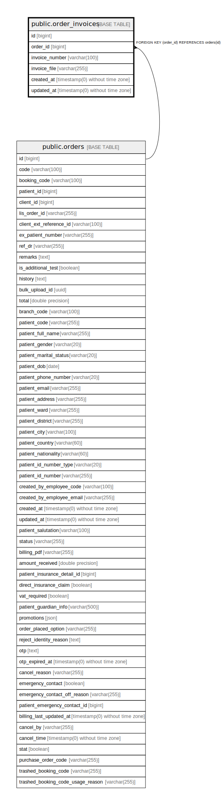

# public.order_invoices

## Description

## Columns

| Name | Type | Default | Nullable | Children | Parents | Comment |
| ---- | ---- | ------- | -------- | -------- | ------- | ------- |
| id | bigint | nextval('order_invoices_id_seq'::regclass) | false |  |  |  |
| order_id | bigint |  | false |  | [public.orders](public.orders.md) |  |
| invoice_number | varchar(100) |  | false |  |  |  |
| invoice_file | varchar(255) |  | true |  |  |  |
| created_at | timestamp(0) without time zone |  | true |  |  |  |
| updated_at | timestamp(0) without time zone |  | true |  |  |  |

## Constraints

| Name | Type | Definition |
| ---- | ---- | ---------- |
| order_invoices_order_id_foreign | FOREIGN KEY | FOREIGN KEY (order_id) REFERENCES orders(id) |
| order_invoices_pkey | PRIMARY KEY | PRIMARY KEY (id) |

## Indexes

| Name | Definition |
| ---- | ---------- |
| order_invoices_pkey | CREATE UNIQUE INDEX order_invoices_pkey ON public.order_invoices USING btree (id) |
| order_invoices_order_id_index | CREATE INDEX order_invoices_order_id_index ON public.order_invoices USING btree (order_id) |
| order_invoices_invoice_number_index | CREATE INDEX order_invoices_invoice_number_index ON public.order_invoices USING btree (invoice_number) |
| order_invoices_created_at_index | CREATE INDEX order_invoices_created_at_index ON public.order_invoices USING btree (created_at) |
| order_invoices_updated_at_index | CREATE INDEX order_invoices_updated_at_index ON public.order_invoices USING btree (updated_at) |

## Relations

---

> Generated by [tbls](https://github.com/k1LoW/tbls)
