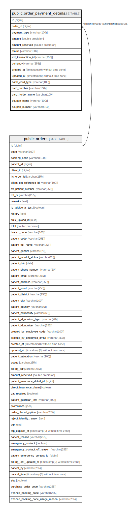

# public.order_payment_details

## Description

## Columns

| Name | Type | Default | Nullable | Children | Parents | Comment |
| ---- | ---- | ------- | -------- | -------- | ------- | ------- |
| id | bigint | nextval('order_payment_details_id_seq'::regclass) | false |  |  |  |
| order_id | bigint |  | false |  | [public.orders](public.orders.md) |  |
| payment_type | varchar(100) |  | false |  |  |  |
| amount | double precision |  | false |  |  |  |
| amount_received | double precision |  | false |  |  |  |
| status | varchar(100) |  | false |  |  |  |
| ext_transaction_id | varchar(255) |  | true |  |  |  |
| currency | varchar(255) | 'VND'::character varying | false |  |  |  |
| created_at | timestamp(0) without time zone |  | true |  |  |  |
| updated_at | timestamp(0) without time zone |  | true |  |  |  |
| bank_card_type | varchar(100) |  | true |  |  |  |
| card_number | varchar(100) |  | true |  |  |  |
| card_holder_name | varchar(100) |  | true |  |  |  |
| coupon_name | varchar(100) |  | true |  |  |  |
| coupon_number | varchar(100) |  | true |  |  |  |

## Constraints

| Name | Type | Definition |
| ---- | ---- | ---------- |
| order_payment_details_order_id_foreign | FOREIGN KEY | FOREIGN KEY (order_id) REFERENCES orders(id) |
| order_payment_details_pkey | PRIMARY KEY | PRIMARY KEY (id) |

## Indexes

| Name | Definition |
| ---- | ---------- |
| order_payment_details_pkey | CREATE UNIQUE INDEX order_payment_details_pkey ON public.order_payment_details USING btree (id) |
| order_id_index | CREATE INDEX order_id_index ON public.order_payment_details USING btree (order_id) |

## Relations

---

> Generated by [tbls](https://github.com/k1LoW/tbls)
