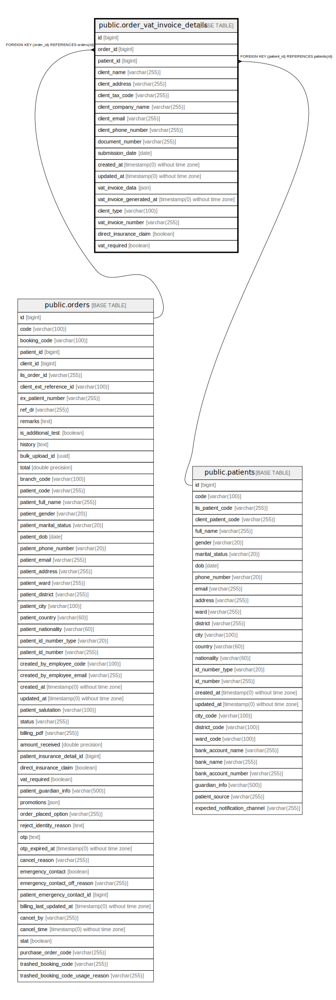

# public.order_vat_invoice_details

## Description

## Columns

| Name | Type | Default | Nullable | Children | Parents | Comment |
| ---- | ---- | ------- | -------- | -------- | ------- | ------- |
| id | bigint | nextval('order_vat_invoice_details_id_seq'::regclass) | false |  |  |  |
| order_id | bigint |  | false |  | [public.orders](public.orders.md) |  |
| patient_id | bigint |  | false |  | [public.patients](public.patients.md) |  |
| client_name | varchar(255) |  | true |  |  |  |
| client_address | varchar(255) |  | true |  |  |  |
| client_tax_code | varchar(255) |  | true |  |  |  |
| client_company_name | varchar(255) |  | true |  |  |  |
| client_email | varchar(255) |  | true |  |  |  |
| client_phone_number | varchar(255) |  | true |  |  |  |
| document_number | varchar(255) |  | true |  |  |  |
| submission_date | date |  | true |  |  |  |
| created_at | timestamp(0) without time zone |  | true |  |  |  |
| updated_at | timestamp(0) without time zone |  | true |  |  |  |
| vat_invoice_data | json |  | true |  |  |  |
| vat_invoice_generated_at | timestamp(0) without time zone |  | true |  |  |  |
| client_type | varchar(100) | 'personal'::character varying | true |  |  |  |
| vat_invoice_number | varchar(255) |  | true |  |  |  |
| direct_insurance_claim | boolean | false | false |  |  |  |
| vat_required | boolean | true | false |  |  |  |

## Constraints

| Name | Type | Definition |
| ---- | ---- | ---------- |
| order_vat_invoice_details_patient_id_foreign | FOREIGN KEY | FOREIGN KEY (patient_id) REFERENCES patients(id) |
| order_vat_invoice_details_order_id_foreign | FOREIGN KEY | FOREIGN KEY (order_id) REFERENCES orders(id) |
| order_vat_invoice_details_pkey | PRIMARY KEY | PRIMARY KEY (id) |

## Indexes

| Name | Definition |
| ---- | ---------- |
| order_vat_invoice_details_pkey | CREATE UNIQUE INDEX order_vat_invoice_details_pkey ON public.order_vat_invoice_details USING btree (id) |
| order_vat_invoice_details_vat_invoice_number_index | CREATE INDEX order_vat_invoice_details_vat_invoice_number_index ON public.order_vat_invoice_details USING btree (vat_invoice_number) |
| order_vat_invoice_details_order_id_index | CREATE INDEX order_vat_invoice_details_order_id_index ON public.order_vat_invoice_details USING btree (order_id) |

## Relations

---

> Generated by [tbls](https://github.com/k1LoW/tbls)
