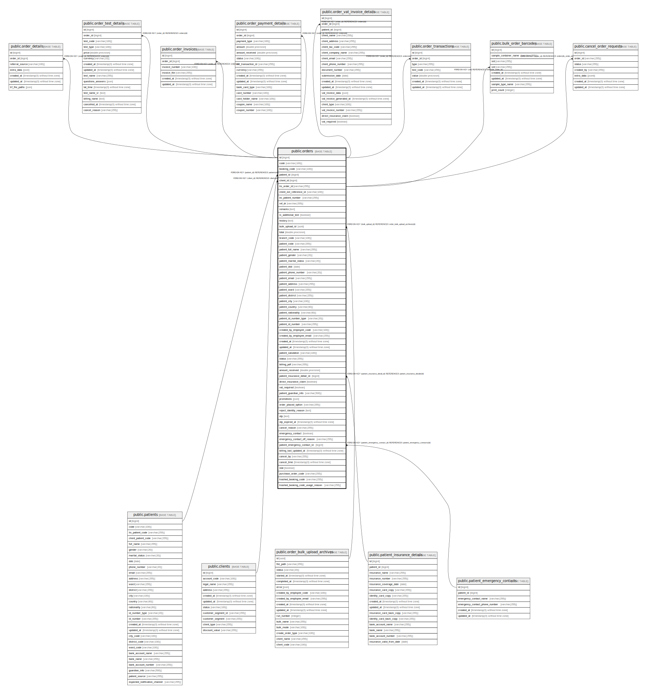

# public.orders

## Description

## Columns

| Name | Type | Default | Nullable | Children | Parents | Comment |
| ---- | ---- | ------- | -------- | -------- | ------- | ------- |
| id | bigint | nextval('orders_id_seq'::regclass) | false | [public.order_details](public.order_details.md) [public.order_test_details](public.order_test_details.md) [public.order_invoices](public.order_invoices.md) [public.order_payment_details](public.order_payment_details.md) [public.order_vat_invoice_details](public.order_vat_invoice_details.md) [public.order_transactions](public.order_transactions.md) |  |  |
| code | varchar(100) |  | false |  |  |  |
| booking_code | varchar(100) |  | true |  |  |  |
| patient_id | bigint |  | true |  | [public.patients](public.patients.md) |  |
| client_id | bigint |  | true |  | [public.clients](public.clients.md) |  |
| lis_order_id | varchar(255) |  | true | [public.bulk_order_barcodes](public.bulk_order_barcodes.md) [public.cancel_order_requests](public.cancel_order_requests.md) |  |  |
| client_ext_reference_id | varchar(100) |  | true |  |  |  |
| ex_patient_number | varchar(255) |  | true |  |  |  |
| ref_dr | varchar(255) |  | true |  |  |  |
| remarks | text |  | true |  |  |  |
| is_additional_test | boolean | false | false |  |  |  |
| history | text |  | true |  |  |  |
| bulk_upload_id | uuid |  | true |  | [public.order_bulk_upload_archives](public.order_bulk_upload_archives.md) |  |
| total | double precision |  | false |  |  |  |
| branch_code | varchar(100) |  | false |  |  |  |
| patient_code | varchar(255) |  | true |  |  |  |
| patient_full_name | varchar(255) |  | false |  |  |  |
| patient_gender | varchar(20) |  | false |  |  |  |
| patient_marital_status | varchar(20) |  | true |  |  |  |
| patient_dob | date |  | false |  |  |  |
| patient_phone_number | varchar(20) |  | true |  |  |  |
| patient_email | varchar(255) |  | true |  |  |  |
| patient_address | varchar(255) |  | true |  |  |  |
| patient_ward | varchar(255) |  | true |  |  |  |
| patient_district | varchar(255) |  | true |  |  |  |
| patient_city | varchar(100) |  | true |  |  |  |
| patient_country | varchar(60) |  | true |  |  |  |
| patient_nationality | varchar(60) |  | true |  |  |  |
| patient_id_number_type | varchar(20) |  | true |  |  |  |
| patient_id_number | varchar(255) |  | true |  |  |  |
| created_by_employee_code | varchar(100) |  | false |  |  |  |
| created_by_employee_email | varchar(255) |  | false |  |  |  |
| created_at | timestamp(0) without time zone |  | true |  |  |  |
| updated_at | timestamp(0) without time zone |  | true |  |  |  |
| patient_salutation | varchar(100) |  | false |  |  |  |
| status | varchar(255) | 'pending'::character varying | false |  |  |  |
| billing_pdf | varchar(255) |  | true |  |  |  |
| amount_received | double precision |  | true |  |  |  |
| patient_insurance_detail_id | bigint |  | true |  | [public.patient_insurance_details](public.patient_insurance_details.md) |  |
| direct_insurance_claim | boolean |  | true |  |  |  |
| vat_required | boolean | false | false |  |  |  |
| patient_guardian_info | varchar(500) |  | true |  |  |  |
| promotions | json |  | true |  |  |  |
| order_placed_option | varchar(255) |  | true |  |  |  |
| reject_identity_reason | text |  | true |  |  |  |
| otp | text |  | true |  |  |  |
| otp_expired_at | timestamp(0) without time zone |  | true |  |  |  |
| cancel_reason | varchar(255) |  | true |  |  |  |
| emergency_contact | boolean | false | false |  |  |  |
| emergency_contact_off_reason | varchar(255) |  | true |  |  |  |
| patient_emergency_contact_id | bigint |  | true |  | [public.patient_emergency_contacts](public.patient_emergency_contacts.md) |  |
| billing_last_updated_at | timestamp(0) without time zone |  | true |  |  |  |
| cancel_by | varchar(255) |  | true |  |  |  |
| cancel_time | timestamp(0) without time zone |  | true |  |  |  |
| stat | boolean |  | true |  |  |  |
| purchase_order_code | varchar(255) |  | true |  |  |  |
| trashed_booking_code | varchar(255) |  | true |  |  |  |
| trashed_booking_code_usage_reason | varchar(255) |  | true |  |  |  |

## Constraints

| Name | Type | Definition |
| ---- | ---- | ---------- |
| orders_patient_id_foreign | FOREIGN KEY | FOREIGN KEY (patient_id) REFERENCES patients(id) |
| orders_client_id_foreign | FOREIGN KEY | FOREIGN KEY (client_id) REFERENCES clients(id) |
| orders_pkey | PRIMARY KEY | PRIMARY KEY (id) |
| orders_bulk_upload_id_foreign | FOREIGN KEY | FOREIGN KEY (bulk_upload_id) REFERENCES order_bulk_upload_archives(id) |
| lis_order_id_unique | UNIQUE | UNIQUE (lis_order_id) |
| orders_patient_insurance_detail_id_foreign | FOREIGN KEY | FOREIGN KEY (patient_insurance_detail_id) REFERENCES patient_insurance_details(id) |
| orders_patient_emergency_contact_id_foreign | FOREIGN KEY | FOREIGN KEY (patient_emergency_contact_id) REFERENCES patient_emergency_contacts(id) |

## Indexes

| Name | Definition |
| ---- | ---------- |
| orders_pkey | CREATE UNIQUE INDEX orders_pkey ON public.orders USING btree (id) |
| orders_code_index | CREATE INDEX orders_code_index ON public.orders USING btree (code) |
| orders_booking_code_index | CREATE INDEX orders_booking_code_index ON public.orders USING btree (booking_code) |
| orders_client_ext_reference_id_index | CREATE INDEX orders_client_ext_reference_id_index ON public.orders USING btree (client_ext_reference_id) |
| orders_created_at_index | CREATE INDEX orders_created_at_index ON public.orders USING btree (created_at) |
| orders_updated_at_index | CREATE INDEX orders_updated_at_index ON public.orders USING btree (updated_at) |
| orders_created_by_employee_code_index | CREATE INDEX orders_created_by_employee_code_index ON public.orders USING btree (created_by_employee_code) |
| orders_created_by_employee_email_index | CREATE INDEX orders_created_by_employee_email_index ON public.orders USING btree (created_by_employee_email) |
| orders_lis_order_id_index | CREATE INDEX orders_lis_order_id_index ON public.orders USING btree (lis_order_id) |
| orders_bulk_upload_id_index | CREATE INDEX orders_bulk_upload_id_index ON public.orders USING btree (bulk_upload_id) |
| orders_client_id_index | CREATE INDEX orders_client_id_index ON public.orders USING btree (client_id) |
| orders_patient_id_index | CREATE INDEX orders_patient_id_index ON public.orders USING btree (patient_id) |
| lis_order_id_unique | CREATE UNIQUE INDEX lis_order_id_unique ON public.orders USING btree (lis_order_id) |

## Relations

---

> Generated by [tbls](https://github.com/k1LoW/tbls)
