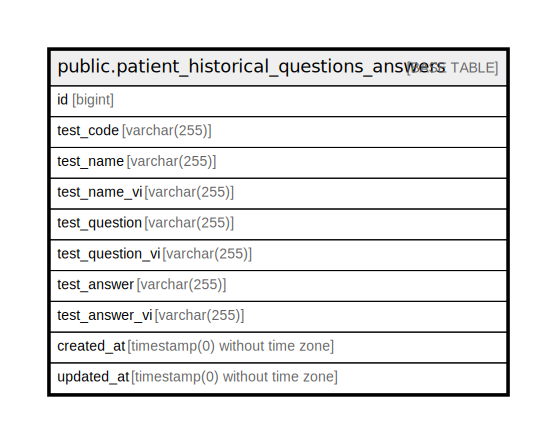

# public.patient_historical_questions_answers

## Description

## Columns

| Name | Type | Default | Nullable | Children | Parents | Comment |
| ---- | ---- | ------- | -------- | -------- | ------- | ------- |
| id | bigint | nextval('patient_historical_questions_answers_id_seq'::regclass) | false |  |  |  |
| test_code | varchar(255) |  | false |  |  |  |
| test_name | varchar(255) |  | true |  |  |  |
| test_name_vi | varchar(255) |  | true |  |  |  |
| test_question | varchar(255) |  | true |  |  |  |
| test_question_vi | varchar(255) |  | true |  |  |  |
| test_answer | varchar(255) |  | true |  |  |  |
| test_answer_vi | varchar(255) |  | true |  |  |  |
| created_at | timestamp(0) without time zone |  | true |  |  |  |
| updated_at | timestamp(0) without time zone |  | true |  |  |  |

## Constraints

| Name | Type | Definition |
| ---- | ---- | ---------- |
| patient_historical_questions_answers_pkey | PRIMARY KEY | PRIMARY KEY (id) |
| patient_historical_questions_answers_test_code_test_question_te | UNIQUE | UNIQUE (test_code, test_question, test_answer) |

## Indexes

| Name | Definition |
| ---- | ---------- |
| patient_historical_questions_answers_pkey | CREATE UNIQUE INDEX patient_historical_questions_answers_pkey ON public.patient_historical_questions_answers USING btree (id) |
| patient_historical_questions_answers_test_code_test_question_te | CREATE UNIQUE INDEX patient_historical_questions_answers_test_code_test_question_te ON public.patient_historical_questions_answers USING btree (test_code, test_question, test_answer) |
| patient_historical_questions_answers_test_code_index | CREATE INDEX patient_historical_questions_answers_test_code_index ON public.patient_historical_questions_answers USING btree (test_code) |

## Relations

---

> Generated by [tbls](https://github.com/k1LoW/tbls)
