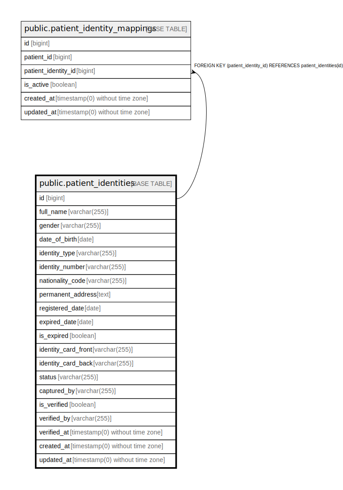

# public.patient_identities

## Description

## Columns

| Name | Type | Default | Nullable | Children | Parents | Comment |
| ---- | ---- | ------- | -------- | -------- | ------- | ------- |
| id | bigint | nextval('patient_identities_id_seq'::regclass) | false | [public.patient_identity_mappings](public.patient_identity_mappings.md) |  |  |
| full_name | varchar(255) |  | false |  |  |  |
| gender | varchar(255) |  | false |  |  | male, female |
| date_of_birth | date |  | false |  |  | YYYY-MM-DD |
| identity_type | varchar(255) | 'id_card'::character varying | false |  |  | id_card, passport |
| identity_number | varchar(255) |  | false |  |  | identity number |
| nationality_code | varchar(255) |  | true |  |  |  |
| permanent_address | text |  | true |  |  |  |
| registered_date | date |  | true |  |  | YYYY-MM-DD |
| expired_date | date |  | true |  |  | YYYY-MM-DD |
| is_expired | boolean | false | false |  |  |  |
| identity_card_front | varchar(255) |  | true |  |  | gs file path |
| identity_card_back | varchar(255) |  | true |  |  | gs file path |
| status | varchar(255) | 'pending'::character varying | false |  |  | pending, rejected, verified |
| captured_by | varchar(255) |  | true |  |  | user email |
| is_verified | boolean | false | false |  |  |  |
| verified_by | varchar(255) |  | true |  |  |  |
| verified_at | timestamp(0) without time zone |  | true |  |  |  |
| created_at | timestamp(0) without time zone |  | true |  |  |  |
| updated_at | timestamp(0) without time zone |  | true |  |  |  |

## Constraints

| Name | Type | Definition |
| ---- | ---- | ---------- |
| patient_identities_pkey | PRIMARY KEY | PRIMARY KEY (id) |
| patient_identities_identity_number_identity_type_nationality_co | UNIQUE | UNIQUE (identity_number, identity_type, nationality_code) |

## Indexes

| Name | Definition |
| ---- | ---------- |
| patient_identities_pkey | CREATE UNIQUE INDEX patient_identities_pkey ON public.patient_identities USING btree (id) |
| patient_identities_identity_number_identity_type_nationality_co | CREATE UNIQUE INDEX patient_identities_identity_number_identity_type_nationality_co ON public.patient_identities USING btree (identity_number, identity_type, nationality_code) |
| patient_identities_identity_number_index | CREATE INDEX patient_identities_identity_number_index ON public.patient_identities USING btree (identity_number) |
| patient_identities_full_name_index | CREATE INDEX patient_identities_full_name_index ON public.patient_identities USING btree (full_name) |
| patient_identities_status_index | CREATE INDEX patient_identities_status_index ON public.patient_identities USING btree (status) |
| patient_identities_verified_by_index | CREATE INDEX patient_identities_verified_by_index ON public.patient_identities USING btree (verified_by) |

## Relations

---

> Generated by [tbls](https://github.com/k1LoW/tbls)
