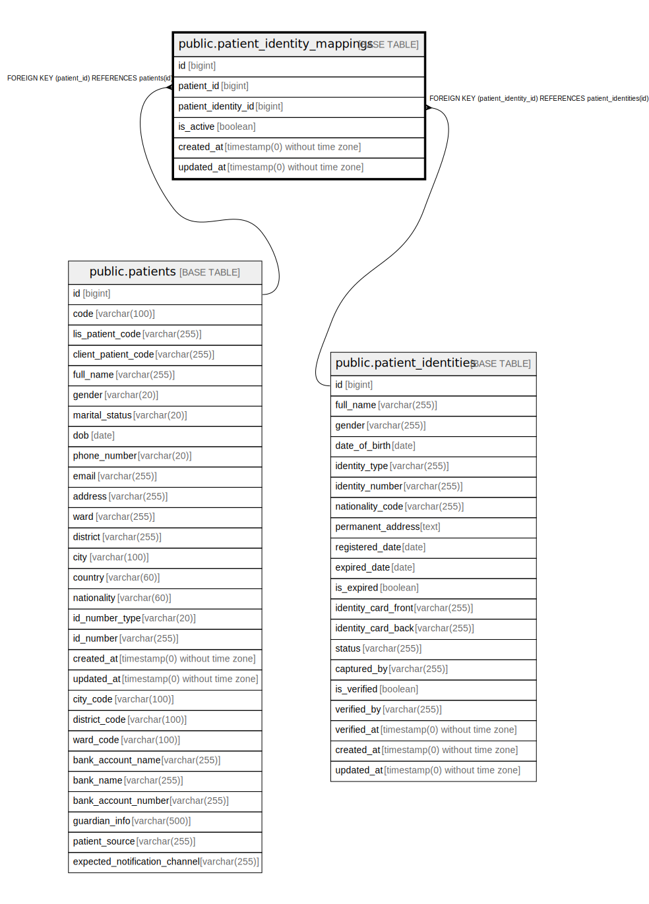

# public.patient_identity_mappings

## Description

## Columns

| Name | Type | Default | Nullable | Children | Parents | Comment |
| ---- | ---- | ------- | -------- | -------- | ------- | ------- |
| id | bigint | nextval('patient_identity_mappings_id_seq'::regclass) | false |  |  |  |
| patient_id | bigint |  | false |  | [public.patients](public.patients.md) |  |
| patient_identity_id | bigint |  | false |  | [public.patient_identities](public.patient_identities.md) |  |
| is_active | boolean | true | false |  |  |  |
| created_at | timestamp(0) without time zone |  | true |  |  |  |
| updated_at | timestamp(0) without time zone |  | true |  |  |  |

## Constraints

| Name | Type | Definition |
| ---- | ---- | ---------- |
| patient_identity_mappings_patient_id_foreign | FOREIGN KEY | FOREIGN KEY (patient_id) REFERENCES patients(id) |
| patient_identity_mappings_patient_identity_id_foreign | FOREIGN KEY | FOREIGN KEY (patient_identity_id) REFERENCES patient_identities(id) |
| patient_identity_mappings_pkey | PRIMARY KEY | PRIMARY KEY (id) |
| patient_identity_mappings_patient_id_patient_identity_id_unique | UNIQUE | UNIQUE (patient_id, patient_identity_id) |

## Indexes

| Name | Definition |
| ---- | ---------- |
| patient_identity_mappings_pkey | CREATE UNIQUE INDEX patient_identity_mappings_pkey ON public.patient_identity_mappings USING btree (id) |
| patient_identity_mappings_patient_id_patient_identity_id_unique | CREATE UNIQUE INDEX patient_identity_mappings_patient_id_patient_identity_id_unique ON public.patient_identity_mappings USING btree (patient_id, patient_identity_id) |

## Relations

---

> Generated by [tbls](https://github.com/k1LoW/tbls)
