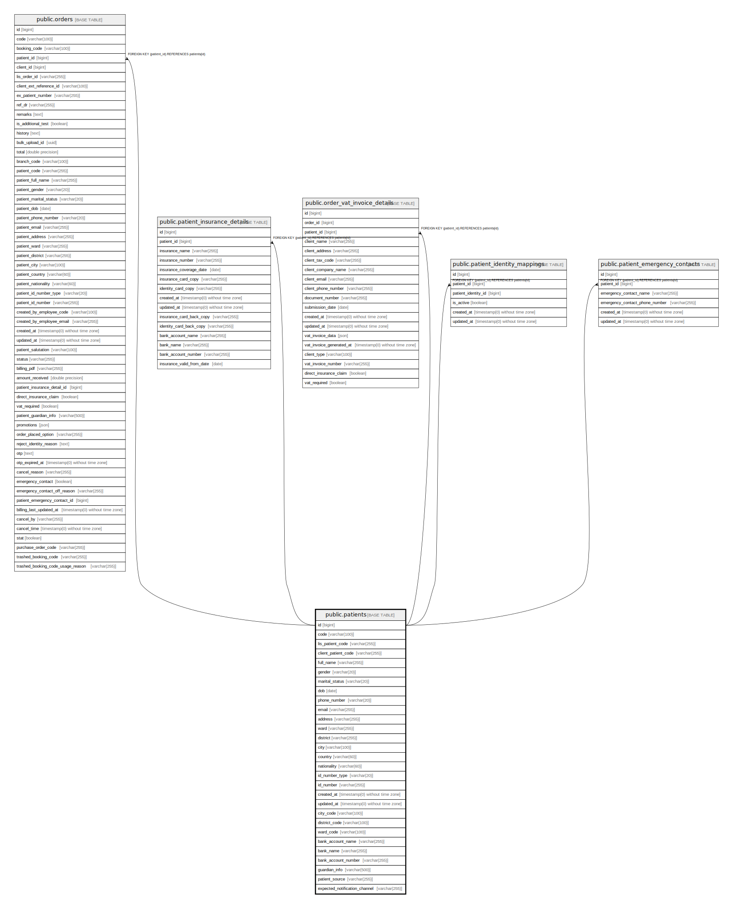

# public.patients

## Description

## Columns

| Name | Type | Default | Nullable | Children | Parents | Comment |
| ---- | ---- | ------- | -------- | -------- | ------- | ------- |
| id | bigint | nextval('patients_id_seq'::regclass) | false | [public.orders](public.orders.md) [public.patient_insurance_details](public.patient_insurance_details.md) [public.order_vat_invoice_details](public.order_vat_invoice_details.md) [public.patient_identity_mappings](public.patient_identity_mappings.md) [public.patient_emergency_contacts](public.patient_emergency_contacts.md) |  |  |
| code | varchar(100) |  | false |  |  |  |
| lis_patient_code | varchar(255) |  | true |  |  |  |
| client_patient_code | varchar(255) |  | true |  |  |  |
| full_name | varchar(255) |  | false |  |  |  |
| gender | varchar(20) |  | true |  |  |  |
| marital_status | varchar(20) |  | true |  |  |  |
| dob | date |  | false |  |  |  |
| phone_number | varchar(20) |  | true |  |  |  |
| email | varchar(255) |  | true |  |  |  |
| address | varchar(255) |  | true |  |  |  |
| ward | varchar(255) |  | true |  |  |  |
| district | varchar(255) |  | true |  |  |  |
| city | varchar(100) |  | true |  |  |  |
| country | varchar(60) |  | true |  |  |  |
| nationality | varchar(60) |  | true |  |  |  |
| id_number_type | varchar(20) |  | true |  |  |  |
| id_number | varchar(255) |  | true |  |  |  |
| created_at | timestamp(0) without time zone |  | true |  |  |  |
| updated_at | timestamp(0) without time zone |  | true |  |  |  |
| city_code | varchar(100) |  | true |  |  |  |
| district_code | varchar(100) |  | true |  |  |  |
| ward_code | varchar(100) |  | true |  |  |  |
| bank_account_name | varchar(255) |  | true |  |  |  |
| bank_name | varchar(255) |  | true |  |  |  |
| bank_account_number | varchar(255) |  | true |  |  |  |
| guardian_info | varchar(500) |  | true |  |  |  |
| patient_source | varchar(255) |  | true |  |  |  |
| expected_notification_channel | varchar(255) | 'zns'::character varying | false |  |  |  |

## Constraints

| Name | Type | Definition |
| ---- | ---- | ---------- |
| patients_pkey | PRIMARY KEY | PRIMARY KEY (id) |
| patients_code_unique | UNIQUE | UNIQUE (code) |
| patients_lis_patient_code_unique | UNIQUE | UNIQUE (lis_patient_code) |

## Indexes

| Name | Definition |
| ---- | ---------- |
| patients_pkey | CREATE UNIQUE INDEX patients_pkey ON public.patients USING btree (id) |
| patients_code_unique | CREATE UNIQUE INDEX patients_code_unique ON public.patients USING btree (code) |
| patients_lis_patient_code_unique | CREATE UNIQUE INDEX patients_lis_patient_code_unique ON public.patients USING btree (lis_patient_code) |

## Relations

---

> Generated by [tbls](https://github.com/k1LoW/tbls)
