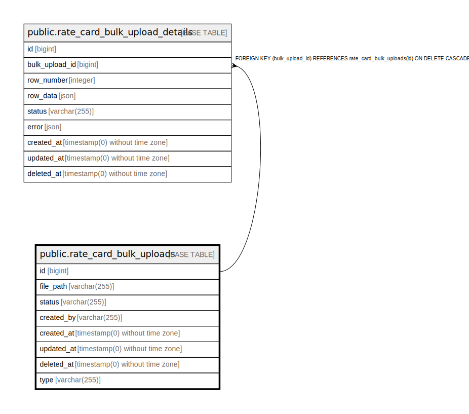

# public.rate_card_bulk_uploads

## Description

## Columns

| Name | Type | Default | Nullable | Children | Parents | Comment |
| ---- | ---- | ------- | -------- | -------- | ------- | ------- |
| id | bigint | nextval('rate_card_bulk_uploads_id_seq'::regclass) | false | [public.rate_card_bulk_upload_details](public.rate_card_bulk_upload_details.md) |  |  |
| file_path | varchar(255) |  | false |  |  |  |
| status | varchar(255) | 'in-progress'::character varying | false |  |  |  |
| created_by | varchar(255) |  | false |  |  |  |
| created_at | timestamp(0) without time zone |  | true |  |  |  |
| updated_at | timestamp(0) without time zone |  | true |  |  |  |
| deleted_at | timestamp(0) without time zone |  | true |  |  |  |
| type | varchar(255) | 'rate_card'::character varying | false |  |  |  |

## Constraints

| Name | Type | Definition |
| ---- | ---- | ---------- |
| rate_card_bulk_uploads_pkey | PRIMARY KEY | PRIMARY KEY (id) |

## Indexes

| Name | Definition |
| ---- | ---------- |
| rate_card_bulk_uploads_pkey | CREATE UNIQUE INDEX rate_card_bulk_uploads_pkey ON public.rate_card_bulk_uploads USING btree (id) |

## Relations

---

> Generated by [tbls](https://github.com/k1LoW/tbls)
