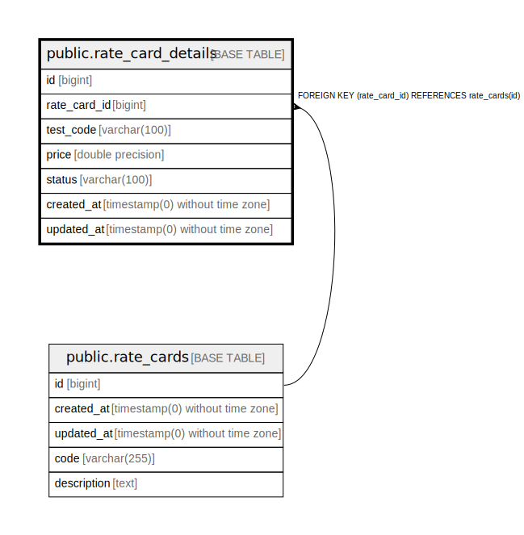

# public.rate_card_details

## Description

## Columns

| Name | Type | Default | Nullable | Children | Parents | Comment |
| ---- | ---- | ------- | -------- | -------- | ------- | ------- |
| id | bigint | nextval('rate_card_details_id_seq'::regclass) | false |  |  |  |
| rate_card_id | bigint |  | false |  | [public.rate_cards](public.rate_cards.md) |  |
| test_code | varchar(100) |  | false |  |  |  |
| price | double precision |  | false |  |  |  |
| status | varchar(100) |  | false |  |  |  |
| created_at | timestamp(0) without time zone |  | true |  |  |  |
| updated_at | timestamp(0) without time zone |  | true |  |  |  |

## Constraints

| Name | Type | Definition |
| ---- | ---- | ---------- |
| rate_card_details_rate_card_id_foreign | FOREIGN KEY | FOREIGN KEY (rate_card_id) REFERENCES rate_cards(id) |
| rate_card_details_pkey | PRIMARY KEY | PRIMARY KEY (id) |

## Indexes

| Name | Definition |
| ---- | ---------- |
| rate_card_details_pkey | CREATE UNIQUE INDEX rate_card_details_pkey ON public.rate_card_details USING btree (id) |
| rate_card_details_rate_card_id_test_code_index | CREATE INDEX rate_card_details_rate_card_id_test_code_index ON public.rate_card_details USING btree (rate_card_id, test_code) |
| rate_card_id_index | CREATE INDEX rate_card_id_index ON public.rate_card_details USING btree (rate_card_id) |

## Relations

---

> Generated by [tbls](https://github.com/k1LoW/tbls)
