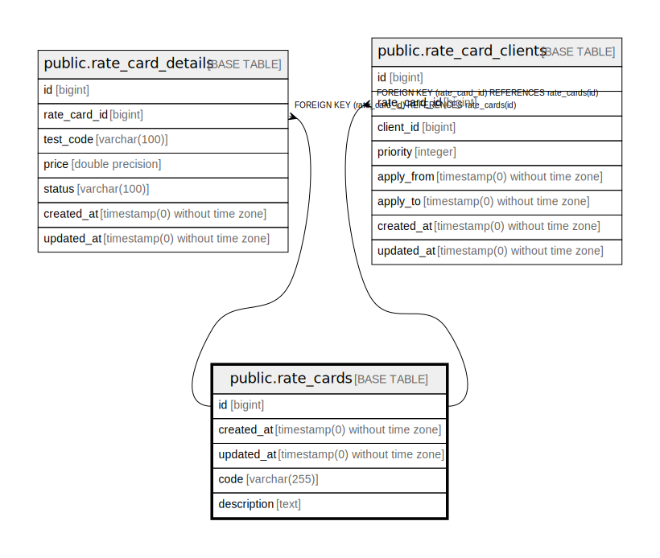

# public.rate_cards

## Description

## Columns

| Name | Type | Default | Nullable | Children | Parents | Comment |
| ---- | ---- | ------- | -------- | -------- | ------- | ------- |
| id | bigint | nextval('rate_cards_id_seq'::regclass) | false | [public.rate_card_details](public.rate_card_details.md) [public.rate_card_clients](public.rate_card_clients.md) |  |  |
| created_at | timestamp(0) without time zone |  | true |  |  |  |
| updated_at | timestamp(0) without time zone |  | true |  |  |  |
| code | varchar(255) |  | false |  |  |  |
| description | text |  | true |  |  |  |

## Constraints

| Name | Type | Definition |
| ---- | ---- | ---------- |
| rate_cards_pkey | PRIMARY KEY | PRIMARY KEY (id) |
| rate_cards_code_unique | UNIQUE | UNIQUE (code) |

## Indexes

| Name | Definition |
| ---- | ---------- |
| rate_cards_pkey | CREATE UNIQUE INDEX rate_cards_pkey ON public.rate_cards USING btree (id) |
| rate_cards_created_at_index | CREATE INDEX rate_cards_created_at_index ON public.rate_cards USING btree (created_at) |
| rate_cards_updated_at_index | CREATE INDEX rate_cards_updated_at_index ON public.rate_cards USING btree (updated_at) |
| rate_cards_code_unique | CREATE UNIQUE INDEX rate_cards_code_unique ON public.rate_cards USING btree (code) |
| rate_cards_code_index | CREATE INDEX rate_cards_code_index ON public.rate_cards USING btree (code) |

## Relations

---

> Generated by [tbls](https://github.com/k1LoW/tbls)
