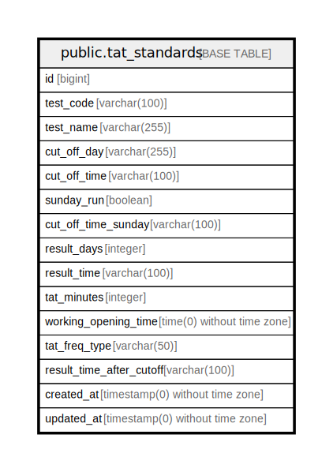

# public.tat_standards

## Description

## Columns

| Name | Type | Default | Nullable | Children | Parents | Comment |
| ---- | ---- | ------- | -------- | -------- | ------- | ------- |
| id | bigint | nextval('tat_standards_id_seq'::regclass) | false |  |  |  |
| test_code | varchar(100) |  | false |  |  |  |
| test_name | varchar(255) |  | false |  |  |  |
| cut_off_day | varchar(255) |  | false |  |  |  |
| cut_off_time | varchar(100) |  | true |  |  |  |
| sunday_run | boolean | false | false |  |  |  |
| cut_off_time_sunday | varchar(100) |  | true |  |  |  |
| result_days | integer |  | false |  |  |  |
| result_time | varchar(100) |  | true |  |  |  |
| tat_minutes | integer |  | true |  |  |  |
| working_opening_time | time(0) without time zone |  | true |  |  |  |
| tat_freq_type | varchar(50) |  | true |  |  |  |
| result_time_after_cutoff | varchar(100) |  | true |  |  |  |
| created_at | timestamp(0) without time zone |  | true |  |  |  |
| updated_at | timestamp(0) without time zone |  | true |  |  |  |

## Constraints

| Name | Type | Definition |
| ---- | ---- | ---------- |
| tat_standards_pkey | PRIMARY KEY | PRIMARY KEY (id) |

## Indexes

| Name | Definition |
| ---- | ---------- |
| tat_standards_pkey | CREATE UNIQUE INDEX tat_standards_pkey ON public.tat_standards USING btree (id) |
| tat_standards_test_code_index | CREATE INDEX tat_standards_test_code_index ON public.tat_standards USING btree (test_code) |

## Relations

---

> Generated by [tbls](https://github.com/k1LoW/tbls)
