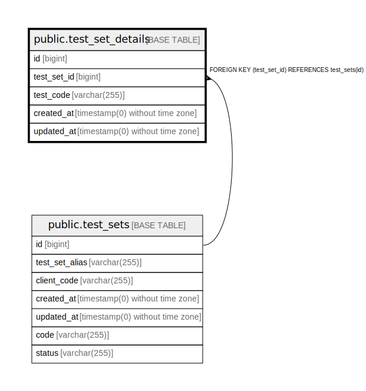

# public.test_set_details

## Description

## Columns

| Name | Type | Default | Nullable | Children | Parents | Comment |
| ---- | ---- | ------- | -------- | -------- | ------- | ------- |
| id | bigint | nextval('test_set_details_id_seq'::regclass) | false |  |  |  |
| test_set_id | bigint |  | false |  | [public.test_sets](public.test_sets.md) |  |
| test_code | varchar(255) |  | false |  |  |  |
| created_at | timestamp(0) without time zone |  | true |  |  |  |
| updated_at | timestamp(0) without time zone |  | true |  |  |  |

## Constraints

| Name | Type | Definition |
| ---- | ---- | ---------- |
| test_set_details_test_set_id_foreign | FOREIGN KEY | FOREIGN KEY (test_set_id) REFERENCES test_sets(id) |
| test_set_details_pkey | PRIMARY KEY | PRIMARY KEY (id) |
| test_set_details_test_set_id_test_code_unique | UNIQUE | UNIQUE (test_set_id, test_code) |

## Indexes

| Name | Definition |
| ---- | ---------- |
| test_set_details_pkey | CREATE UNIQUE INDEX test_set_details_pkey ON public.test_set_details USING btree (id) |
| test_set_details_test_set_id_test_code_unique | CREATE UNIQUE INDEX test_set_details_test_set_id_test_code_unique ON public.test_set_details USING btree (test_set_id, test_code) |

## Relations

---

> Generated by [tbls](https://github.com/k1LoW/tbls)
