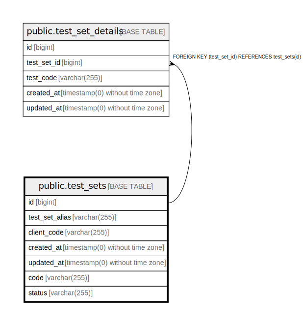

# public.test_sets

## Description

## Columns

| Name | Type | Default | Nullable | Children | Parents | Comment |
| ---- | ---- | ------- | -------- | -------- | ------- | ------- |
| id | bigint | nextval('test_sets_id_seq'::regclass) | false | [public.test_set_details](public.test_set_details.md) |  |  |
| test_set_alias | varchar(255) |  | false |  |  |  |
| client_code | varchar(255) |  | false |  |  |  |
| created_at | timestamp(0) without time zone |  | true |  |  |  |
| updated_at | timestamp(0) without time zone |  | true |  |  |  |
| code | varchar(255) |  | false |  |  |  |
| status | varchar(255) |  | false |  |  |  |

## Constraints

| Name | Type | Definition |
| ---- | ---- | ---------- |
| test_sets_pkey | PRIMARY KEY | PRIMARY KEY (id) |
| test_sets_test_set_alias_client_code_unique | UNIQUE | UNIQUE (test_set_alias, client_code) |
| test_sets_code_unique | UNIQUE | UNIQUE (code) |

## Indexes

| Name | Definition |
| ---- | ---------- |
| test_sets_pkey | CREATE UNIQUE INDEX test_sets_pkey ON public.test_sets USING btree (id) |
| test_sets_test_set_alias_client_code_index | CREATE INDEX test_sets_test_set_alias_client_code_index ON public.test_sets USING btree (test_set_alias, client_code) |
| test_sets_test_set_alias_client_code_unique | CREATE UNIQUE INDEX test_sets_test_set_alias_client_code_unique ON public.test_sets USING btree (test_set_alias, client_code) |
| test_sets_code_unique | CREATE UNIQUE INDEX test_sets_code_unique ON public.test_sets USING btree (code) |

## Relations

---

> Generated by [tbls](https://github.com/k1LoW/tbls)
