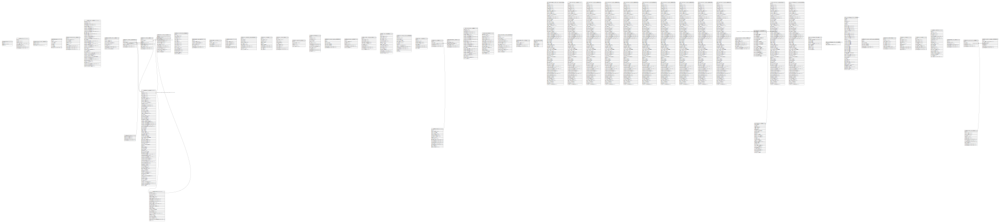

# staging-spc--lis--be

## Tables

| Name | Columns | Comment | Type |
| ---- | ------- | ------- | ---- |
| [public.migrations](public.migrations.md) | 3 |  | BASE TABLE |
| [public.users](public.users.md) | 8 |  | BASE TABLE |
| [public.password_reset_tokens](public.password_reset_tokens.md) | 3 |  | BASE TABLE |
| [public.failed_jobs](public.failed_jobs.md) | 7 |  | BASE TABLE |
| [public.personal_access_tokens](public.personal_access_tokens.md) | 10 |  | BASE TABLE |
| [public.order_samples](public.order_samples.md) | 38 |  | BASE TABLE |
| [public.lab_machine_test_codes](public.lab_machine_test_codes.md) | 9 |  | BASE TABLE |
| [public.approvers](public.approvers.md) | 4 |  | BASE TABLE |
| [public.orders](public.orders.md) | 24 |  | BASE TABLE |
| [public.test_results](public.test_results.md) | 79 |  | BASE TABLE |
| [public.test_result_audits](public.test_result_audits.md) | 9 |  | BASE TABLE |
| [public.test_results_approvers](public.test_results_approvers.md) | 6 |  | BASE TABLE |
| [public.test_reference_ranges](public.test_reference_ranges.md) | 17 |  | BASE TABLE |
| [public.sample_type_imports](public.sample_type_imports.md) | 7 |  | BASE TABLE |
| [public.sample_runners](public.sample_runners.md) | 5 |  | BASE TABLE |
| [public.sections](public.sections.md) | 7 |  | BASE TABLE |
| [public.order_result_services](public.order_result_services.md) | 14 |  | BASE TABLE |
| [public.test_calculation_dependencies](public.test_calculation_dependencies.md) | 10 |  | BASE TABLE |
| [public.test_formulas](public.test_formulas.md) | 10 |  | BASE TABLE |
| [public.test_conversions](public.test_conversions.md) | 10 |  | BASE TABLE |
| [public.auto_approval_tests](public.auto_approval_tests.md) | 5 |  | BASE TABLE |
| [public.attachments](public.attachments.md) | 13 |  | BASE TABLE |
| [public.batch_async_queue_producer](public.batch_async_queue_producer.md) | 7 |  | BASE TABLE |
| [public.workorders_devices](public.workorders_devices.md) | 7 |  | BASE TABLE |
| [public.int_client_configurations](public.int_client_configurations.md) | 10 |  | BASE TABLE |
| [public.int_test_mappings](public.int_test_mappings.md) | 16 |  | BASE TABLE |
| [public.test_result_status_changes](public.test_result_status_changes.md) | 13 |  | BASE TABLE |
| [public.order_recollects](public.order_recollects.md) | 8 |  | BASE TABLE |
| [public.batches](public.batches.md) | 15 |  | BASE TABLE |
| [public.batch_samples](public.batch_samples.md) | 5 |  | BASE TABLE |
| [public.replacement_tests](public.replacement_tests.md) | 6 |  | BASE TABLE |
| [vinh_test.order_samples](vinh_test.order_samples.md) | 25 |  | BASE TABLE |
| [vinh_test.orders](vinh_test.orders.md) | 17 |  | BASE TABLE |
| [vinh_test.order_result_services](vinh_test.order_result_services.md) | 14 |  | BASE TABLE |
| [public.sample_print_configs](public.sample_print_configs.md) | 5 |  | BASE TABLE |
| [partman.table_privs](partman.table_privs.md) | 5 |  | VIEW |
| [partman.template_vinh_test_test_results](partman.template_vinh_test_test_results.md) | 68 |  | BASE TABLE |
| [vinh_test.test_results](vinh_test.test_results.md) | 68 |  | BASE TABLE |
| [vinh_test.test_results_p2024_11](vinh_test.test_results_p2024_11.md) | 68 |  | BASE TABLE |
| [vinh_test.test_results_p2024_12](vinh_test.test_results_p2024_12.md) | 68 |  | BASE TABLE |
| [vinh_test.test_results_p2025_01](vinh_test.test_results_p2025_01.md) | 68 |  | BASE TABLE |
| [vinh_test.test_results_default](vinh_test.test_results_default.md) | 68 |  | BASE TABLE |
| [vinh_test.test_results_p2024_07](vinh_test.test_results_p2024_07.md) | 68 |  | BASE TABLE |
| [vinh_test.test_results_p2024_08](vinh_test.test_results_p2024_08.md) | 68 |  | BASE TABLE |
| [vinh_test.test_results_p2024_09](vinh_test.test_results_p2024_09.md) | 68 |  | BASE TABLE |
| [vinh_test.test_results_p2024_10](vinh_test.test_results_p2024_10.md) | 68 |  | BASE TABLE |
| [vinh_test.test_results_orders_view](vinh_test.test_results_orders_view.md) | 9 |  | VIEW |
| [partman.part_config](partman.part_config.md) | 24 |  | BASE TABLE |
| [partman.part_config_sub](partman.part_config_sub.md) | 21 |  | BASE TABLE |
| [vinh_test.test_results_ctas](vinh_test.test_results_ctas.md) | 68 |  | BASE TABLE |
| [data_archiving.test_results_archive](data_archiving.test_results_archive.md) | 68 |  | BASE TABLE |
| [data_archiving.archive_logs](data_archiving.archive_logs.md) | 10 |  | BASE TABLE |
| [data_archiving.pg_stat_statements_info](data_archiving.pg_stat_statements_info.md) | 2 |  | VIEW |
| [data_archiving.pg_stat_statements](data_archiving.pg_stat_statements.md) | 43 |  | VIEW |
| [public.batch_async_audit_queue_producer](public.batch_async_audit_queue_producer.md) | 7 |  | BASE TABLE |
| [public.order_monitorings](public.order_monitorings.md) | 9 |  | BASE TABLE |
| [public.tat_configs](public.tat_configs.md) | 10 |  | BASE TABLE |
| [public.tat_stands](public.tat_stands.md) | 10 |  | BASE TABLE |
| [public.tat_alerts](public.tat_alerts.md) | 22 |  | BASE TABLE |
| [public.disabled_tat_alerts](public.disabled_tat_alerts.md) | 6 |  | BASE TABLE |
| [public.batches_outsource](public.batches_outsource.md) | 12 |  | BASE TABLE |
| [public.batch_outsource_samples](public.batch_outsource_samples.md) | 5 |  | BASE TABLE |
| [public.tat_alerts_summary_histories](public.tat_alerts_summary_histories.md) | 7 |  | BASE TABLE |

## Stored procedures and functions

| Name | ReturnType | Arguments | Type |
| ---- | ------- | ------- | ---- |
| public.gtrgm_in | gtrgm | cstring | FUNCTION |
| public.gtrgm_out | cstring | gtrgm | FUNCTION |
| partman.apply_cluster | void | p_parent_schema text, p_parent_tablename text, p_child_schema text, p_child_tablename text | FUNCTION |
| partman.apply_constraints | void | p_parent_table text, p_child_table text DEFAULT NULL::text, p_analyze boolean DEFAULT false, p_job_id bigint DEFAULT NULL::bigint | FUNCTION |
| partman.apply_privileges | void | p_parent_schema text, p_parent_tablename text, p_child_schema text, p_child_tablename text, p_job_id bigint DEFAULT NULL::bigint | FUNCTION |
| partman.autovacuum_off | bool | p_parent_schema text, p_parent_tablename text, p_source_schema text DEFAULT NULL::text, p_source_tablename text DEFAULT NULL::text | FUNCTION |
| partman.autovacuum_reset | bool | p_parent_schema text, p_parent_tablename text, p_source_schema text DEFAULT NULL::text, p_source_tablename text DEFAULT NULL::text | FUNCTION |
| partman.check_automatic_maintenance_value | bool | p_automatic_maintenance text | FUNCTION |
| partman.check_control_type | record | p_parent_schema text, p_parent_tablename text, p_control text | FUNCTION |
| partman.check_default | check_default_table | p_exact_count boolean DEFAULT true | FUNCTION |
| partman.check_epoch_type | bool | p_type text | FUNCTION |
| partman.check_name_length | text | p_object_name text, p_suffix text DEFAULT NULL::text, p_table_partition boolean DEFAULT false | FUNCTION |
| partman.check_partition_type | bool | p_type text | FUNCTION |
| partman.check_subpartition_limits | record | p_parent_table text, p_type text, OUT sub_min text, OUT sub_max text | FUNCTION |
| partman.drop_constraints | void | p_parent_table text, p_child_table text, p_debug boolean DEFAULT false | FUNCTION |
| partman.drop_partition_id | int4 | p_parent_table text, p_retention bigint DEFAULT NULL::bigint, p_keep_table boolean DEFAULT NULL::boolean, p_keep_index boolean DEFAULT NULL::boolean, p_retention_schema text DEFAULT NULL::text | FUNCTION |
| partman.drop_partition_time | int4 | p_parent_table text, p_retention interval DEFAULT NULL::interval, p_keep_table boolean DEFAULT NULL::boolean, p_keep_index boolean DEFAULT NULL::boolean, p_retention_schema text DEFAULT NULL::text, p_reference_timestamp timestamp with time zone DEFAULT CURRENT_TIMESTAMP | FUNCTION |
| partman.dump_partitioned_table_definition | text | p_parent_table text, p_ignore_template_table boolean DEFAULT false | FUNCTION |
| partman.inherit_template_properties | bool | p_parent_table text, p_child_schema text, p_child_tablename text | FUNCTION |
| partman.partition_data_id | int8 | p_parent_table text, p_batch_count integer DEFAULT 1, p_batch_interval bigint DEFAULT NULL::bigint, p_lock_wait numeric DEFAULT 0, p_order text DEFAULT 'ASC'::text, p_analyze boolean DEFAULT true, p_source_table text DEFAULT NULL::text, p_ignored_columns text[] DEFAULT NULL::text[] | FUNCTION |
| partman.partition_data_time | int8 | p_parent_table text, p_batch_count integer DEFAULT 1, p_batch_interval interval DEFAULT NULL::interval, p_lock_wait numeric DEFAULT 0, p_order text DEFAULT 'ASC'::text, p_analyze boolean DEFAULT true, p_source_table text DEFAULT NULL::text, p_ignored_columns text[] DEFAULT NULL::text[] | FUNCTION |
| partman.partition_gap_fill | int4 | p_parent_table text | FUNCTION |
| partman.reapply_constraints_proc | void | IN p_parent_table text, IN p_drop_constraints boolean DEFAULT false, IN p_apply_constraints boolean DEFAULT false, IN p_wait integer DEFAULT 0, IN p_dryrun boolean DEFAULT false | PROCEDURE |
| partman.reapply_privileges | void | p_parent_table text | FUNCTION |
| partman.run_analyze | void | IN p_skip_locked boolean DEFAULT false, IN p_quiet boolean DEFAULT false, IN p_parent_table text DEFAULT NULL::text | PROCEDURE |
| partman.show_partition_info | record | p_child_table text, p_partition_interval text DEFAULT NULL::text, p_parent_table text DEFAULT NULL::text, OUT child_start_time timestamp with time zone, OUT child_end_time timestamp with time zone, OUT child_start_id bigint, OUT child_end_id bigint, OUT suffix text | FUNCTION |
| partman.show_partition_name | record | p_parent_table text, p_value text, OUT partition_schema text, OUT partition_table text, OUT suffix_timestamp timestamp with time zone, OUT suffix_id bigint, OUT table_exists boolean | FUNCTION |
| partman.show_partitions | record | p_parent_table text, p_order text DEFAULT 'ASC'::text, p_include_default boolean DEFAULT false | FUNCTION |
| partman.stop_sub_partition | bool | p_parent_table text, p_jobmon boolean DEFAULT true | FUNCTION |
| public.gin_extract_query_trgm | internal | text, internal, smallint, internal, internal, internal, internal | FUNCTION |
| public.gin_extract_value_trgm | internal | text, internal | FUNCTION |
| public.gin_trgm_consistent | bool | internal, smallint, text, integer, internal, internal, internal, internal | FUNCTION |
| public.gin_trgm_triconsistent | char | internal, smallint, text, integer, internal, internal, internal | FUNCTION |
| public.gtrgm_compress | internal | internal | FUNCTION |
| public.gtrgm_consistent | bool | internal, text, smallint, oid, internal | FUNCTION |
| public.gtrgm_decompress | internal | internal | FUNCTION |
| public.gtrgm_distance | float8 | internal, text, smallint, oid, internal | FUNCTION |
| public.gtrgm_penalty | internal | internal, internal, internal | FUNCTION |
| public.gtrgm_picksplit | internal | internal, internal | FUNCTION |
| public.gtrgm_same | internal | gtrgm, gtrgm, internal | FUNCTION |
| public.gtrgm_union | gtrgm | internal, internal | FUNCTION |
| public.set_limit | float4 | real | FUNCTION |
| public.show_limit | float4 |  | FUNCTION |
| public.show_trgm | _text | text | FUNCTION |
| public.similarity | float4 | text, text | FUNCTION |
| public.similarity_dist | float4 | text, text | FUNCTION |
| public.similarity_op | bool | text, text | FUNCTION |
| public.strict_word_similarity | float4 | text, text | FUNCTION |
| public.strict_word_similarity_commutator_op | bool | text, text | FUNCTION |
| public.strict_word_similarity_dist_commutator_op | float4 | text, text | FUNCTION |
| public.strict_word_similarity_dist_op | float4 | text, text | FUNCTION |
| public.strict_word_similarity_op | bool | text, text | FUNCTION |
| public.word_similarity | float4 | text, text | FUNCTION |
| public.word_similarity_commutator_op | bool | text, text | FUNCTION |
| public.word_similarity_dist_commutator_op | float4 | text, text | FUNCTION |
| public.word_similarity_dist_op | float4 | text, text | FUNCTION |
| public.word_similarity_op | bool | text, text | FUNCTION |
| partman.calculate_time_partition_info | record | p_time_interval interval, p_start_time timestamp with time zone, p_date_trunc_interval text DEFAULT NULL::text, OUT base_timestamp timestamp with time zone, OUT datetime_string text | FUNCTION |
| partman.check_subpart_sameconfig | record | p_parent_table text | FUNCTION |
| partman.create_parent | bool | p_parent_table text, p_control text, p_interval text, p_type text DEFAULT 'range'::text, p_epoch text DEFAULT 'none'::text, p_premake integer DEFAULT 4, p_start_partition text DEFAULT NULL::text, p_default_table boolean DEFAULT true, p_automatic_maintenance text DEFAULT 'on'::text, p_constraint_cols text[] DEFAULT NULL::text[], p_template_table text DEFAULT NULL::text, p_jobmon boolean DEFAULT true, p_date_trunc_interval text DEFAULT NULL::text | FUNCTION |
| partman.create_partition_id | bool | p_parent_table text, p_partition_ids bigint[], p_start_partition text DEFAULT NULL::text | FUNCTION |
| partman.create_partition_time | bool | p_parent_table text, p_partition_times timestamp with time zone[], p_start_partition text DEFAULT NULL::text | FUNCTION |
| partman.create_sub_parent | bool | p_top_parent text, p_control text, p_interval text, p_type text DEFAULT 'range'::text, p_default_table boolean DEFAULT true, p_declarative_check text DEFAULT NULL::text, p_constraint_cols text[] DEFAULT NULL::text[], p_premake integer DEFAULT 4, p_start_partition text DEFAULT NULL::text, p_epoch text DEFAULT 'none'::text, p_jobmon boolean DEFAULT true, p_date_trunc_interval text DEFAULT NULL::text | FUNCTION |
| partman.run_maintenance | void | p_parent_table text DEFAULT NULL::text, p_analyze boolean DEFAULT false, p_jobmon boolean DEFAULT true | FUNCTION |
| partman.undo_partition | record | p_parent_table text, p_target_table text, p_loop_count integer DEFAULT 1, p_batch_interval text DEFAULT NULL::text, p_keep_table boolean DEFAULT true, p_lock_wait numeric DEFAULT 0, p_ignored_columns text[] DEFAULT NULL::text[], p_drop_cascade boolean DEFAULT false, OUT partitions_undone integer, OUT rows_undone bigint | FUNCTION |
| partman.partition_data_proc | void | IN p_parent_table text, IN p_loop_count integer DEFAULT NULL::integer, IN p_interval text DEFAULT NULL::text, IN p_lock_wait integer DEFAULT 0, IN p_lock_wait_tries integer DEFAULT 10, IN p_wait integer DEFAULT 1, IN p_order text DEFAULT 'ASC'::text, IN p_source_table text DEFAULT NULL::text, IN p_ignored_columns text[] DEFAULT NULL::text[], IN p_quiet boolean DEFAULT false | PROCEDURE |
| partman.run_maintenance_proc | void | IN p_wait integer DEFAULT 0, IN p_analyze boolean DEFAULT false, IN p_jobmon boolean DEFAULT true | PROCEDURE |
| partman.undo_partition_proc | void | IN p_parent_table text, IN p_target_table text DEFAULT NULL::text, IN p_loop_count integer DEFAULT NULL::integer, IN p_interval text DEFAULT NULL::text, IN p_keep_table boolean DEFAULT true, IN p_lock_wait integer DEFAULT 0, IN p_lock_wait_tries integer DEFAULT 10, IN p_wait integer DEFAULT 1, IN p_ignored_columns text[] DEFAULT NULL::text[], IN p_drop_cascade boolean DEFAULT false, IN p_quiet boolean DEFAULT false | PROCEDURE |
| data_archiving.get_archive_status | record | p_days_history integer DEFAULT 7 | FUNCTION |
| data_archiving.monitor_archive_progress | record |  | FUNCTION |
| data_archiving.estimate_archive_size | record | p_source_schema text, p_source_table text, p_timestamp_column text, p_months_old integer | FUNCTION |
| data_archiving.archive_old_data | void | IN p_source_schema text, IN p_source_table text, IN p_archive_schema text, IN p_archive_table text, IN p_timestamp_column text DEFAULT 'created_at'::text, IN p_months_old integer DEFAULT 24, IN p_batch_size integer DEFAULT 10000, IN p_max_runtime_minutes integer DEFAULT 120, IN p_sleep_between_batches integer DEFAULT 1 | PROCEDURE |
| public.pg_prewarm | int8 | regclass, mode text DEFAULT 'buffer'::text, fork text DEFAULT 'main'::text, first_block bigint DEFAULT NULL::bigint, last_block bigint DEFAULT NULL::bigint | FUNCTION |
| public.autoprewarm_start_worker | void |  | FUNCTION |
| public.autoprewarm_dump_now | int8 |  | FUNCTION |
| data_archiving.pg_stat_statements_reset | void | userid oid DEFAULT 0, dbid oid DEFAULT 0, queryid bigint DEFAULT 0 | FUNCTION |
| data_archiving.pg_stat_statements_info | record | OUT dealloc bigint, OUT stats_reset timestamp with time zone | FUNCTION |
| data_archiving.pg_stat_statements | record | showtext boolean, OUT userid oid, OUT dbid oid, OUT toplevel boolean, OUT queryid bigint, OUT query text, OUT plans bigint, OUT total_plan_time double precision, OUT min_plan_time double precision, OUT max_plan_time double precision, OUT mean_plan_time double precision, OUT stddev_plan_time double precision, OUT calls bigint, OUT total_exec_time double precision, OUT min_exec_time double precision, OUT max_exec_time double precision, OUT mean_exec_time double precision, OUT stddev_exec_time double precision, OUT rows bigint, OUT shared_blks_hit bigint, OUT shared_blks_read bigint, OUT shared_blks_dirtied bigint, OUT shared_blks_written bigint, OUT local_blks_hit bigint, OUT local_blks_read bigint, OUT local_blks_dirtied bigint, OUT local_blks_written bigint, OUT temp_blks_read bigint, OUT temp_blks_written bigint, OUT blk_read_time double precision, OUT blk_write_time double precision, OUT temp_blk_read_time double precision, OUT temp_blk_write_time double precision, OUT wal_records bigint, OUT wal_fpi bigint, OUT wal_bytes numeric, OUT jit_functions bigint, OUT jit_generation_time double precision, OUT jit_inlining_count bigint, OUT jit_inlining_time double precision, OUT jit_optimization_count bigint, OUT jit_optimization_time double precision, OUT jit_emission_count bigint, OUT jit_emission_time double precision | FUNCTION |

## Relations

---

> Generated by [tbls](https://github.com/k1LoW/tbls)
