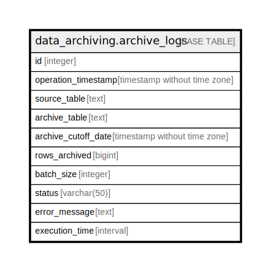

# data_archiving.archive_logs

## Description

## Columns

| Name | Type | Default | Nullable | Children | Parents | Comment |
| ---- | ---- | ------- | -------- | -------- | ------- | ------- |
| id | integer | nextval('data_archiving.archive_logs_id_seq'::regclass) | false |  |  |  |
| operation_timestamp | timestamp without time zone | CURRENT_TIMESTAMP | true |  |  |  |
| source_table | text |  | true |  |  |  |
| archive_table | text |  | true |  |  |  |
| archive_cutoff_date | timestamp without time zone |  | true |  |  |  |
| rows_archived | bigint |  | true |  |  |  |
| batch_size | integer |  | true |  |  |  |
| status | varchar(50) |  | true |  |  |  |
| error_message | text |  | true |  |  |  |
| execution_time | interval |  | true |  |  |  |

## Constraints

| Name | Type | Definition |
| ---- | ---- | ---------- |
| archive_logs_pkey | PRIMARY KEY | PRIMARY KEY (id) |

## Indexes

| Name | Definition |
| ---- | ---------- |
| archive_logs_pkey | CREATE UNIQUE INDEX archive_logs_pkey ON data_archiving.archive_logs USING btree (id) |

## Relations

---

> Generated by [tbls](https://github.com/k1LoW/tbls)
