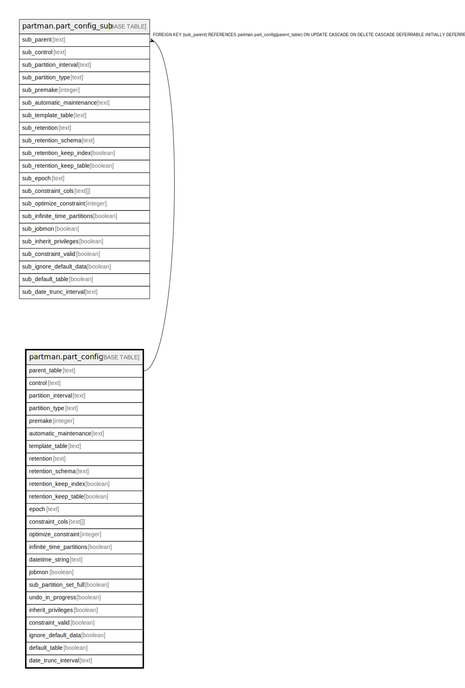

# partman.part_config

## Description

## Columns

| Name | Type | Default | Nullable | Children | Parents | Comment |
| ---- | ---- | ------- | -------- | -------- | ------- | ------- |
| parent_table | text |  | false | [partman.part_config_sub](partman.part_config_sub.md) |  |  |
| control | text |  | false |  |  |  |
| partition_interval | text |  | false |  |  |  |
| partition_type | text |  | false |  |  |  |
| premake | integer | 4 | false |  |  |  |
| automatic_maintenance | text | 'on'::text | false |  |  |  |
| template_table | text |  | true |  |  |  |
| retention | text |  | true |  |  |  |
| retention_schema | text |  | true |  |  |  |
| retention_keep_index | boolean | true | false |  |  |  |
| retention_keep_table | boolean | true | false |  |  |  |
| epoch | text | 'none'::text | false |  |  |  |
| constraint_cols | text[] |  | true |  |  |  |
| optimize_constraint | integer | 30 | false |  |  |  |
| infinite_time_partitions | boolean | false | false |  |  |  |
| datetime_string | text |  | true |  |  |  |
| jobmon | boolean | true | false |  |  |  |
| sub_partition_set_full | boolean | false | false |  |  |  |
| undo_in_progress | boolean | false | false |  |  |  |
| inherit_privileges | boolean | false | true |  |  |  |
| constraint_valid | boolean | true | false |  |  |  |
| ignore_default_data | boolean | true | false |  |  |  |
| default_table | boolean | true | true |  |  |  |
| date_trunc_interval | text |  | true |  |  |  |

## Constraints

| Name | Type | Definition |
| ---- | ---- | ---------- |
| control_constraint_col_chk | CHECK | CHECK (((constraint_cols @> ARRAY[control]) <> true)) |
| part_config_automatic_maintenance_check | CHECK | CHECK (partman.check_automatic_maintenance_value(automatic_maintenance)) |
| part_config_epoch_check | CHECK | CHECK (partman.check_epoch_type(epoch)) |
| part_config_type_check | CHECK | CHECK (partman.check_partition_type(partition_type)) |
| positive_premake_check | CHECK | CHECK ((premake > 0)) |
| retention_schema_not_empty_chk | CHECK | CHECK ((retention_schema <> ''::text)) |
| part_config_parent_table_pkey | PRIMARY KEY | PRIMARY KEY (parent_table) |

## Indexes

| Name | Definition |
| ---- | ---------- |
| part_config_parent_table_pkey | CREATE UNIQUE INDEX part_config_parent_table_pkey ON partman.part_config USING btree (parent_table) |
| part_config_type_idx | CREATE INDEX part_config_type_idx ON partman.part_config USING btree (partition_type) |

## Relations

---

> Generated by [tbls](https://github.com/k1LoW/tbls)
