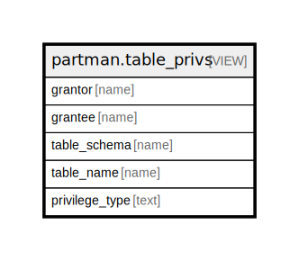

# partman.table_privs

## Description

<details>
<summary><strong>Table Definition</strong></summary>

```sql
CREATE VIEW table_privs AS (
 SELECT u_grantor.rolname AS grantor,
    grantee.rolname AS grantee,
    nc.nspname AS table_schema,
    c.relname AS table_name,
    c.prtype AS privilege_type
   FROM ( SELECT pg_class.oid,
            pg_class.relname,
            pg_class.relnamespace,
            pg_class.relkind,
            pg_class.relowner,
            (aclexplode(COALESCE(pg_class.relacl, acldefault('r'::"char", pg_class.relowner)))).grantor AS grantor,
            (aclexplode(COALESCE(pg_class.relacl, acldefault('r'::"char", pg_class.relowner)))).grantee AS grantee,
            (aclexplode(COALESCE(pg_class.relacl, acldefault('r'::"char", pg_class.relowner)))).privilege_type AS privilege_type,
            (aclexplode(COALESCE(pg_class.relacl, acldefault('r'::"char", pg_class.relowner)))).is_grantable AS is_grantable
           FROM pg_class) c(oid, relname, relnamespace, relkind, relowner, grantor, grantee, prtype, grantable),
    pg_namespace nc,
    pg_roles u_grantor,
    ( SELECT pg_roles.oid,
            pg_roles.rolname
           FROM pg_roles
        UNION ALL
         SELECT (0)::oid AS oid,
            'PUBLIC'::name AS name) grantee(oid, rolname)
  WHERE ((c.relnamespace = nc.oid) AND (c.relkind = ANY (ARRAY['r'::"char", 'v'::"char", 'p'::"char"])) AND (c.grantee = grantee.oid) AND (c.grantor = u_grantor.oid) AND (c.prtype = ANY (ARRAY['INSERT'::text, 'SELECT'::text, 'UPDATE'::text, 'DELETE'::text, 'TRUNCATE'::text, 'REFERENCES'::text, 'TRIGGER'::text])) AND (pg_has_role(u_grantor.oid, 'USAGE'::text) OR pg_has_role(grantee.oid, 'USAGE'::text) OR (grantee.rolname = 'PUBLIC'::name)))
)
```

</details>

## Columns

| Name | Type | Default | Nullable | Children | Parents | Comment |
| ---- | ---- | ------- | -------- | -------- | ------- | ------- |
| grantor | name |  | true |  |  |  |
| grantee | name |  | true |  |  |  |
| table_schema | name |  | true |  |  |  |
| table_name | name |  | true |  |  |  |
| privilege_type | text |  | true |  |  |  |

## Referenced Tables

| Name | Columns | Comment | Type |
| ---- | ------- | ------- | ---- |
| [pg_class](pg_class.md) | 0 |  |  |
| [pg_roles](pg_roles.md) | 0 |  |  |

## Relations



---

> Generated by [tbls](https://github.com/k1LoW/tbls)
