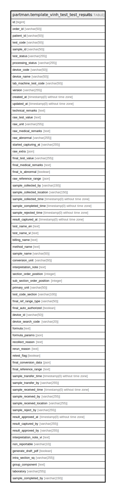

# partman.template_vinh_test_test_results

## Description

## Columns

| Name | Type | Default | Nullable | Children | Parents | Comment |
| ---- | ---- | ------- | -------- | -------- | ------- | ------- |
| id | bigint |  | false |  |  |  |
| order_id | varchar(50) |  | true |  |  |  |
| patient_id | varchar(50) |  | true |  |  |  |
| test_code | varchar(50) |  | true |  |  |  |
| sample_id | varchar(50) |  | false |  |  |  |
| test_status | varchar(255) |  | false |  |  |  |
| processing_status | varchar(255) |  | true |  |  |  |
| device_code | varchar(50) |  | true |  |  |  |
| device_name | varchar(50) |  | true |  |  |  |
| lab_machine_test_code | varchar(50) |  | true |  |  |  |
| version | varchar(255) |  | true |  |  |  |
| created_at | timestamp(0) without time zone |  | true |  |  |  |
| updated_at | timestamp(0) without time zone |  | true |  |  |  |
| technical_remarks | text |  | true |  |  |  |
| raw_test_value | text |  | true |  |  |  |
| raw_unit | varchar(255) |  | true |  |  |  |
| raw_medical_remarks | text |  | true |  |  |  |
| raw_abnormal | varchar(255) |  | true |  |  |  |
| started_capturing_at | varchar(255) |  | true |  |  |  |
| raw_extra | json |  | true |  |  |  |
| final_test_value | varchar(255) |  | true |  |  |  |
| final_medical_remarks | text |  | true |  |  |  |
| final_is_abnormal | boolean |  | true |  |  |  |
| raw_reference_range | json |  | true |  |  |  |
| sample_collected_by | varchar(150) |  | true |  |  |  |
| sample_collected_location | varchar(150) |  | true |  |  |  |
| sample_collected_time | timestamp(0) without time zone |  | true |  |  |  |
| sample_completed_time | timestamp(0) without time zone |  | true |  |  |  |
| sample_rejected_time | timestamp(0) without time zone |  | true |  |  |  |
| result_captured_at | timestamp(0) without time zone |  | true |  |  |  |
| test_name_en | text |  | true |  |  |  |
| test_name_vi | text |  | true |  |  |  |
| billing_name | text |  | true |  |  |  |
| method_name | text |  | true |  |  |  |
| sample_name | varchar(50) |  | true |  |  |  |
| conversion_unit | varchar(50) |  | true |  |  |  |
| interpretation_note | text |  | true |  |  |  |
| section_order_position | integer |  | true |  |  |  |
| sub_section_order_position | integer |  | true |  |  |  |
| primary_unit | varchar(50) |  | true |  |  |  |
| test_code_section | varchar(100) |  | true |  |  |  |
| final_ref_range_type | varchar(50) |  | true |  |  |  |
| final_auto_authorized | boolean |  | false |  |  |  |
| device_id | varchar(50) |  | true |  |  |  |
| device_search_code | varchar(20) |  | true |  |  |  |
| formula | text |  | true |  |  |  |
| formula_params | json |  | true |  |  |  |
| recollect_reason | text |  | true |  |  |  |
| rerun_reason | text |  | true |  |  |  |
| retest_flag | boolean |  | false |  |  |  |
| final_conversion_data | json |  | true |  |  |  |
| final_reference_range | text |  | true |  |  |  |
| sample_transfer_time | timestamp(0) without time zone |  | true |  |  |  |
| sample_transfer_by | varchar(255) |  | true |  |  |  |
| sample_received_time | timestamp(0) without time zone |  | true |  |  |  |
| sample_received_by | varchar(255) |  | true |  |  |  |
| sample_received_location | varchar(255) |  | true |  |  |  |
| sample_reject_by | varchar(255) |  | true |  |  |  |
| result_approved_at | timestamp(0) without time zone |  | true |  |  |  |
| result_captured_by | varchar(255) |  | true |  |  |  |
| result_approved_by | varchar(255) |  | true |  |  |  |
| interpretation_note_vi | text |  | true |  |  |  |
| non_reportable | varchar(10) |  | false |  |  |  |
| generate_draft_pdf | boolean |  | false |  |  |  |
| intra_section_sq | varchar(255) |  | true |  |  |  |
| group_component | text |  | true |  |  |  |
| laboratory | varchar(255) |  | true |  |  |  |
| sample_completed_by | varchar(150) |  | true |  |  |  |

## Relations

---

> Generated by [tbls](https://github.com/k1LoW/tbls)
