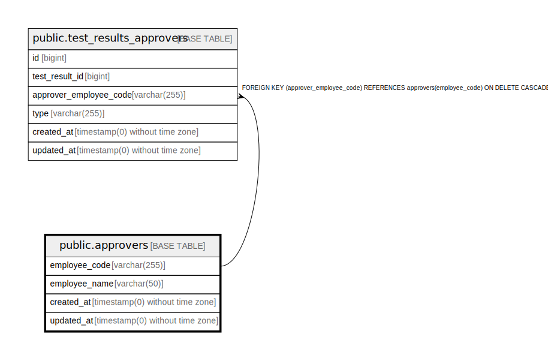

# public.approvers

## Description

## Columns

| Name | Type | Default | Nullable | Children | Parents | Comment |
| ---- | ---- | ------- | -------- | -------- | ------- | ------- |
| employee_code | varchar(255) |  | false | [public.test_results_approvers](public.test_results_approvers.md) |  | Unique code for the employee |
| employee_name | varchar(50) |  | false |  |  | Name of the employee |
| created_at | timestamp(0) without time zone |  | true |  |  |  |
| updated_at | timestamp(0) without time zone |  | true |  |  |  |

## Constraints

| Name | Type | Definition |
| ---- | ---- | ---------- |
| approvers_pkey | PRIMARY KEY | PRIMARY KEY (employee_code) |

## Indexes

| Name | Definition |
| ---- | ---------- |
| approvers_pkey | CREATE UNIQUE INDEX approvers_pkey ON public.approvers USING btree (employee_code) |

## Relations

---

> Generated by [tbls](https://github.com/k1LoW/tbls)
