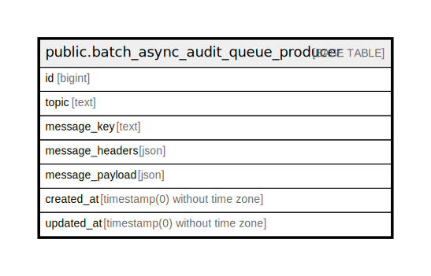

# public.batch_async_audit_queue_producer

## Description

## Columns

| Name | Type | Default | Nullable | Children | Parents | Comment |
| ---- | ---- | ------- | -------- | -------- | ------- | ------- |
| id | bigint | nextval('batch_async_audit_queue_producer_id_seq'::regclass) | false |  |  |  |
| topic | text |  | false |  |  |  |
| message_key | text |  | true |  |  |  |
| message_headers | json |  | true |  |  |  |
| message_payload | json |  | false |  |  |  |
| created_at | timestamp(0) without time zone |  | true |  |  |  |
| updated_at | timestamp(0) without time zone |  | true |  |  |  |

## Constraints

| Name | Type | Definition |
| ---- | ---- | ---------- |
| batch_async_audit_queue_producer_pkey | PRIMARY KEY | PRIMARY KEY (id) |

## Indexes

| Name | Definition |
| ---- | ---------- |
| batch_async_audit_queue_producer_pkey | CREATE UNIQUE INDEX batch_async_audit_queue_producer_pkey ON public.batch_async_audit_queue_producer USING btree (id) |
| batch_async_audit_queue_producer_topic_index | CREATE INDEX batch_async_audit_queue_producer_topic_index ON public.batch_async_audit_queue_producer USING btree (topic) |
| batch_async_audit_queue_producer_message_key_index | CREATE INDEX batch_async_audit_queue_producer_message_key_index ON public.batch_async_audit_queue_producer USING btree (message_key) |

## Relations

---

> Generated by [tbls](https://github.com/k1LoW/tbls)
