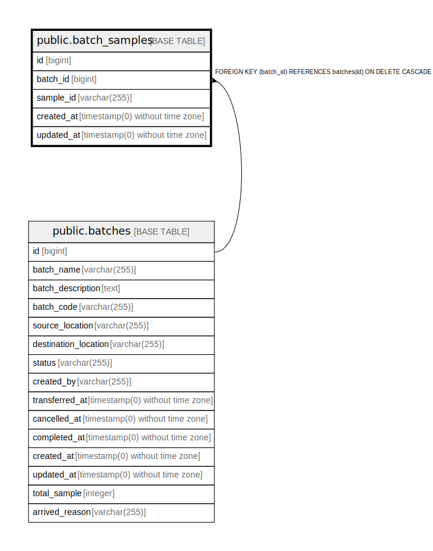

# public.batch_samples

## Description

## Columns

| Name | Type | Default | Nullable | Children | Parents | Comment |
| ---- | ---- | ------- | -------- | -------- | ------- | ------- |
| id | bigint | nextval('batch_samples_id_seq'::regclass) | false |  |  |  |
| batch_id | bigint |  | false |  | [public.batches](public.batches.md) |  |
| sample_id | varchar(255) |  | false |  |  |  |
| created_at | timestamp(0) without time zone |  | true |  |  |  |
| updated_at | timestamp(0) without time zone |  | true |  |  |  |

## Constraints

| Name | Type | Definition |
| ---- | ---- | ---------- |
| batch_samples_batch_id_foreign | FOREIGN KEY | FOREIGN KEY (batch_id) REFERENCES batches(id) ON DELETE CASCADE |
| batch_samples_pkey | PRIMARY KEY | PRIMARY KEY (id) |
| batch_samples_batch_id_sample_id_unique | UNIQUE | UNIQUE (batch_id, sample_id) |

## Indexes

| Name | Definition |
| ---- | ---------- |
| batch_samples_pkey | CREATE UNIQUE INDEX batch_samples_pkey ON public.batch_samples USING btree (id) |
| batch_samples_batch_id_sample_id_unique | CREATE UNIQUE INDEX batch_samples_batch_id_sample_id_unique ON public.batch_samples USING btree (batch_id, sample_id) |

## Relations

---

> Generated by [tbls](https://github.com/k1LoW/tbls)
