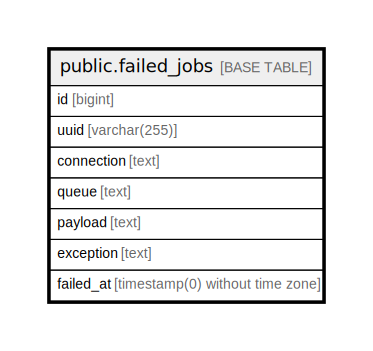

# public.failed_jobs

## Description

## Columns

| Name | Type | Default | Nullable | Children | Parents | Comment |
| ---- | ---- | ------- | -------- | -------- | ------- | ------- |
| id | bigint | nextval('failed_jobs_id_seq'::regclass) | false |  |  |  |
| uuid | varchar(255) |  | false |  |  |  |
| connection | text |  | false |  |  |  |
| queue | text |  | false |  |  |  |
| payload | text |  | false |  |  |  |
| exception | text |  | false |  |  |  |
| failed_at | timestamp(0) without time zone | CURRENT_TIMESTAMP | false |  |  |  |

## Constraints

| Name | Type | Definition |
| ---- | ---- | ---------- |
| failed_jobs_pkey | PRIMARY KEY | PRIMARY KEY (id) |
| failed_jobs_uuid_unique | UNIQUE | UNIQUE (uuid) |

## Indexes

| Name | Definition |
| ---- | ---------- |
| failed_jobs_pkey | CREATE UNIQUE INDEX failed_jobs_pkey ON public.failed_jobs USING btree (id) |
| failed_jobs_uuid_unique | CREATE UNIQUE INDEX failed_jobs_uuid_unique ON public.failed_jobs USING btree (uuid) |

## Relations

---

> Generated by [tbls](https://github.com/k1LoW/tbls)
