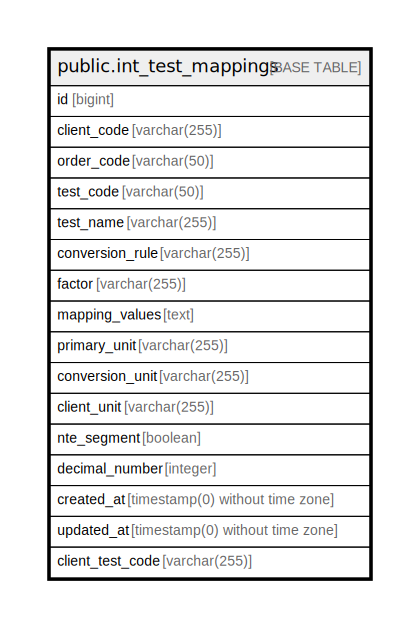

# public.int_test_mappings

## Description

## Columns

| Name | Type | Default | Nullable | Children | Parents | Comment |
| ---- | ---- | ------- | -------- | -------- | ------- | ------- |
| id | bigint | nextval('int_test_mappings_id_seq'::regclass) | false |  |  |  |
| client_code | varchar(255) |  | false |  |  |  |
| order_code | varchar(50) |  | true |  |  |  |
| test_code | varchar(50) |  | false |  |  |  |
| test_name | varchar(255) |  | true |  |  |  |
| conversion_rule | varchar(255) |  | false |  |  | enum: [NONE, MATH, QUALITATIVE_VALUE] |
| factor | varchar(255) |  | true |  |  |  |
| mapping_values | text |  | true |  |  |  |
| primary_unit | varchar(255) |  | true |  |  |  |
| conversion_unit | varchar(255) |  | true |  |  |  |
| client_unit | varchar(255) |  | true |  |  |  |
| nte_segment | boolean | false | false |  |  |  |
| decimal_number | integer | 2 | false |  |  |  |
| created_at | timestamp(0) without time zone |  | true |  |  |  |
| updated_at | timestamp(0) without time zone |  | true |  |  |  |
| client_test_code | varchar(255) |  | true |  |  |  |

## Constraints

| Name | Type | Definition |
| ---- | ---- | ---------- |
| int_test_mappings_pkey | PRIMARY KEY | PRIMARY KEY (id) |

## Indexes

| Name | Definition |
| ---- | ---------- |
| int_test_mappings_pkey | CREATE UNIQUE INDEX int_test_mappings_pkey ON public.int_test_mappings USING btree (id) |
| test_mappings_client_code | CREATE INDEX test_mappings_client_code ON public.int_test_mappings USING btree (client_code) |

## Relations

---

> Generated by [tbls](https://github.com/k1LoW/tbls)
