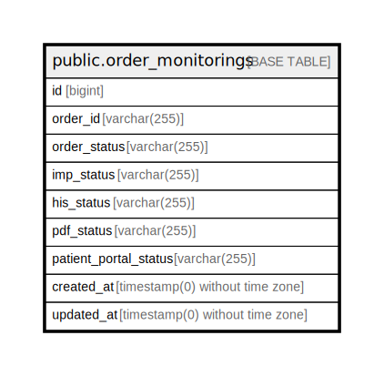

# public.order_monitorings

## Description

## Columns

| Name | Type | Default | Nullable | Children | Parents | Comment |
| ---- | ---- | ------- | -------- | -------- | ------- | ------- |
| id | bigint | nextval('order_monitorings_id_seq'::regclass) | false |  |  |  |
| order_id | varchar(255) |  | false |  |  |  |
| order_status | varchar(255) | 'ordered'::character varying | true |  |  |  |
| imp_status | varchar(255) | 'ordered'::character varying | true |  |  |  |
| his_status | varchar(255) | 'ordered'::character varying | true |  |  |  |
| pdf_status | varchar(255) | 'ordered'::character varying | true |  |  |  |
| patient_portal_status | varchar(255) | 'ordered'::character varying | true |  |  |  |
| created_at | timestamp(0) without time zone |  | true |  |  |  |
| updated_at | timestamp(0) without time zone |  | true |  |  |  |

## Constraints

| Name | Type | Definition |
| ---- | ---- | ---------- |
| order_monitorings_pkey | PRIMARY KEY | PRIMARY KEY (id) |

## Indexes

| Name | Definition |
| ---- | ---------- |
| order_monitorings_pkey | CREATE UNIQUE INDEX order_monitorings_pkey ON public.order_monitorings USING btree (id) |

## Relations

---

> Generated by [tbls](https://github.com/k1LoW/tbls)
