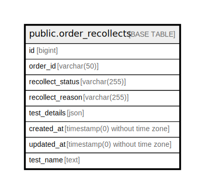

# public.order_recollects

## Description

## Columns

| Name | Type | Default | Nullable | Children | Parents | Comment |
| ---- | ---- | ------- | -------- | -------- | ------- | ------- |
| id | bigint | nextval('order_recollects_id_seq'::regclass) | false |  |  |  |
| order_id | varchar(50) |  | false |  |  |  |
| recollect_status | varchar(255) |  | false |  |  |  |
| recollect_reason | varchar(255) |  | true |  |  |  |
| test_details | json |  | false |  |  |  |
| created_at | timestamp(0) without time zone |  | true |  |  |  |
| updated_at | timestamp(0) without time zone |  | true |  |  |  |
| test_name | text |  | true |  |  |  |

## Constraints

| Name | Type | Definition |
| ---- | ---- | ---------- |
| order_recollects_pkey | PRIMARY KEY | PRIMARY KEY (id) |

## Indexes

| Name | Definition |
| ---- | ---------- |
| order_recollects_pkey | CREATE UNIQUE INDEX order_recollects_pkey ON public.order_recollects USING btree (id) |

## Relations

---

> Generated by [tbls](https://github.com/k1LoW/tbls)
