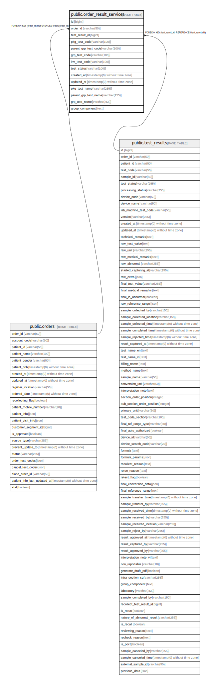

# public.order_result_services

## Description

## Columns

| Name | Type | Default | Nullable | Children | Parents | Comment |
| ---- | ---- | ------- | -------- | -------- | ------- | ------- |
| id | bigint | nextval('order_result_services_id_seq'::regclass) | false |  |  |  |
| order_id | varchar(50) |  | false |  | [public.orders](public.orders.md) |  |
| test_result_id | bigint |  | true |  | [public.test_results](public.test_results.md) |  |
| pkg_test_code | varchar(100) |  | true |  |  | Order test code level 1 |
| parent_grp_test_code | varchar(100) |  | true |  |  | Order test code level 1 |
| grp_test_code | varchar(100) |  | true |  |  | Order test code level 2 |
| inv_test_code | varchar(100) |  | false |  |  | Order test code level 3 |
| test_status | varchar(100) |  | false |  |  | test status of inv test in group |
| created_at | timestamp(0) without time zone |  | true |  |  |  |
| updated_at | timestamp(0) without time zone |  | true |  |  |  |
| pkg_test_name | varchar(255) |  | true |  |  |  |
| parent_grp_test_name | varchar(255) |  | true |  |  |  |
| grp_test_name | varchar(255) |  | true |  |  |  |
| group_component | text |  | true |  |  |  |

## Constraints

| Name | Type | Definition |
| ---- | ---- | ---------- |
| order_result_services_order_id_foreign | FOREIGN KEY | FOREIGN KEY (order_id) REFERENCES orders(order_id) |
| order_result_services_test_result_id_foreign | FOREIGN KEY | FOREIGN KEY (test_result_id) REFERENCES test_results(id) |
| order_result_services_pkey | PRIMARY KEY | PRIMARY KEY (id) |

## Indexes

| Name | Definition |
| ---- | ---------- |
| order_result_services_pkey | CREATE UNIQUE INDEX order_result_services_pkey ON public.order_result_services USING btree (id) |
| order_result_services_order_id_index | CREATE INDEX order_result_services_order_id_index ON public.order_result_services USING btree (order_id) |
| order_result_services_test_result_id_index | CREATE INDEX order_result_services_test_result_id_index ON public.order_result_services USING btree (test_result_id) |
| order_result_services_order_id_parent_grp_test_code_index | CREATE INDEX order_result_services_order_id_parent_grp_test_code_index ON public.order_result_services USING btree (order_id, parent_grp_test_code) |
| order_result_services_order_id_grp_test_code_index | CREATE INDEX order_result_services_order_id_grp_test_code_index ON public.order_result_services USING btree (order_id, grp_test_code) |
| order_result_services_order_id_inv_test_code_index | CREATE INDEX order_result_services_order_id_inv_test_code_index ON public.order_result_services USING btree (order_id, inv_test_code) |
| order_result_services_test_codes_idx | CREATE INDEX order_result_services_test_codes_idx ON public.order_result_services USING btree (inv_test_code, grp_test_code) WHERE ((inv_test_code IS NOT NULL) AND (grp_test_code IS NOT NULL)) |
| pending_list_ors_test_order_idx | CREATE INDEX pending_list_ors_test_order_idx ON public.order_result_services USING btree (test_result_id, order_id) |

## Relations

---

> Generated by [tbls](https://github.com/k1LoW/tbls)
