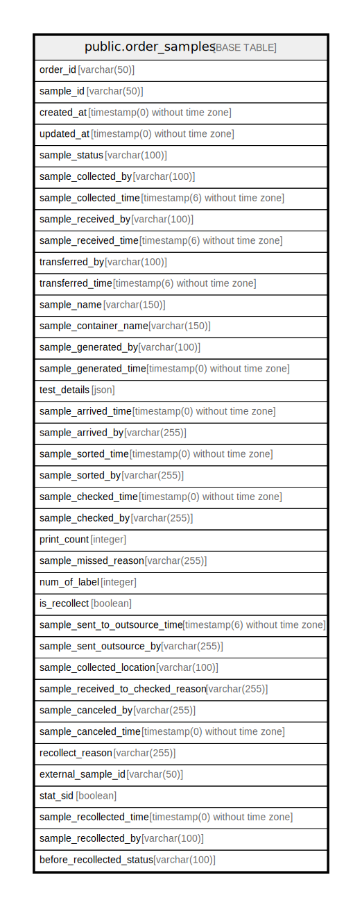

# public.order_samples

## Description

## Columns

| Name | Type | Default | Nullable | Children | Parents | Comment |
| ---- | ---- | ------- | -------- | -------- | ------- | ------- |
| order_id | varchar(50) |  | false |  |  | Attune VID |
| sample_id | varchar(50) |  | false |  |  | Attune Sample ID |
| created_at | timestamp(0) without time zone |  | true |  |  |  |
| updated_at | timestamp(0) without time zone |  | true |  |  |  |
| sample_status | varchar(100) |  | true |  |  |  |
| sample_collected_by | varchar(100) |  | true |  |  |  |
| sample_collected_time | timestamp(6) without time zone |  | true |  |  |  |
| sample_received_by | varchar(100) |  | true |  |  |  |
| sample_received_time | timestamp(6) without time zone |  | true |  |  |  |
| transferred_by | varchar(100) |  | true |  |  |  |
| transferred_time | timestamp(6) without time zone |  | true |  |  |  |
| sample_name | varchar(150) |  | true |  |  |  |
| sample_container_name | varchar(150) |  | true |  |  |  |
| sample_generated_by | varchar(100) |  | true |  |  |  |
| sample_generated_time | timestamp(0) without time zone |  | true |  |  |  |
| test_details | json |  | true |  |  |  |
| sample_arrived_time | timestamp(0) without time zone |  | true |  |  |  |
| sample_arrived_by | varchar(255) |  | true |  |  |  |
| sample_sorted_time | timestamp(0) without time zone |  | true |  |  |  |
| sample_sorted_by | varchar(255) |  | true |  |  |  |
| sample_checked_time | timestamp(0) without time zone |  | true |  |  |  |
| sample_checked_by | varchar(255) |  | true |  |  |  |
| print_count | integer | 0 | false |  |  |  |
| sample_missed_reason | varchar(255) |  | true |  |  |  |
| num_of_label | integer | 1 | false |  |  |  |
| is_recollect | boolean | false | false |  |  |  |
| sample_sent_to_outsource_time | timestamp(6) without time zone |  | true |  |  |  |
| sample_sent_outsource_by | varchar(255) |  | true |  |  |  |
| sample_collected_location | varchar(100) |  | true |  |  |  |
| sample_received_to_checked_reason | varchar(255) |  | true |  |  |  |
| sample_canceled_by | varchar(255) |  | true |  |  |  |
| sample_canceled_time | timestamp(0) without time zone |  | true |  |  |  |
| recollect_reason | varchar(255) |  | true |  |  |  |
| external_sample_id | varchar(50) |  | true |  |  |  |
| stat_sid | boolean |  | true |  |  |  |
| sample_recollected_time | timestamp(0) without time zone |  | true |  |  |  |
| sample_recollected_by | varchar(100) |  | true |  |  |  |
| before_recollected_status | varchar(100) |  | true |  |  |  |

## Constraints

| Name | Type | Definition |
| ---- | ---- | ---------- |
| order_samples_pkey | PRIMARY KEY | PRIMARY KEY (order_id, sample_id) |

## Indexes

| Name | Definition |
| ---- | ---------- |
| order_samples_pkey | CREATE UNIQUE INDEX order_samples_pkey ON public.order_samples USING btree (order_id, sample_id) |
| order_samples_order_id_index | CREATE INDEX order_samples_order_id_index ON public.order_samples USING btree (order_id) |
| order_samples_sample_status_index | CREATE INDEX order_samples_sample_status_index ON public.order_samples USING btree (sample_status) |
| outsource_order_samples_idx | CREATE INDEX outsource_order_samples_idx ON public.order_samples USING btree (sample_id, created_at, sample_status) |
| order_samples_external_sample_id_index | CREATE INDEX order_samples_external_sample_id_index ON public.order_samples USING btree (external_sample_id) |
| outsource_test_os_idx | CREATE INDEX outsource_test_os_idx ON public.order_samples USING btree (sample_status, created_at) INCLUDE (sample_id) |

## Relations

---

> Generated by [tbls](https://github.com/k1LoW/tbls)
