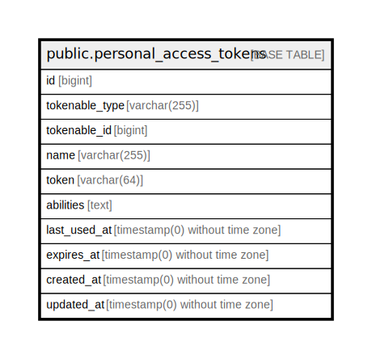

# public.personal_access_tokens

## Description

## Columns

| Name | Type | Default | Nullable | Children | Parents | Comment |
| ---- | ---- | ------- | -------- | -------- | ------- | ------- |
| id | bigint | nextval('personal_access_tokens_id_seq'::regclass) | false |  |  |  |
| tokenable_type | varchar(255) |  | false |  |  |  |
| tokenable_id | bigint |  | false |  |  |  |
| name | varchar(255) |  | false |  |  |  |
| token | varchar(64) |  | false |  |  |  |
| abilities | text |  | true |  |  |  |
| last_used_at | timestamp(0) without time zone |  | true |  |  |  |
| expires_at | timestamp(0) without time zone |  | true |  |  |  |
| created_at | timestamp(0) without time zone |  | true |  |  |  |
| updated_at | timestamp(0) without time zone |  | true |  |  |  |

## Constraints

| Name | Type | Definition |
| ---- | ---- | ---------- |
| personal_access_tokens_pkey | PRIMARY KEY | PRIMARY KEY (id) |
| personal_access_tokens_token_unique | UNIQUE | UNIQUE (token) |

## Indexes

| Name | Definition |
| ---- | ---------- |
| personal_access_tokens_pkey | CREATE UNIQUE INDEX personal_access_tokens_pkey ON public.personal_access_tokens USING btree (id) |
| personal_access_tokens_token_unique | CREATE UNIQUE INDEX personal_access_tokens_token_unique ON public.personal_access_tokens USING btree (token) |

## Relations

---

> Generated by [tbls](https://github.com/k1LoW/tbls)
