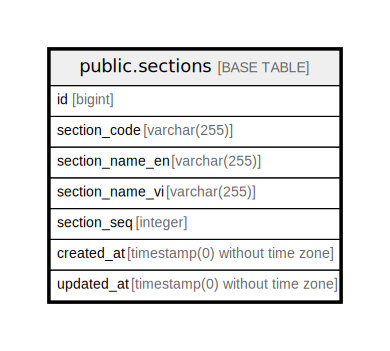

# public.sections

## Description

## Columns

| Name | Type | Default | Nullable | Children | Parents | Comment |
| ---- | ---- | ------- | -------- | -------- | ------- | ------- |
| id | bigint | nextval('sections_id_seq'::regclass) | false |  |  |  |
| section_code | varchar(255) |  | false |  |  |  |
| section_name_en | varchar(255) |  | true |  |  |  |
| section_name_vi | varchar(255) |  | true |  |  |  |
| section_seq | integer |  | true |  |  | Section sequence |
| created_at | timestamp(0) without time zone |  | true |  |  |  |
| updated_at | timestamp(0) without time zone |  | true |  |  |  |

## Constraints

| Name | Type | Definition |
| ---- | ---- | ---------- |
| sections_pkey | PRIMARY KEY | PRIMARY KEY (id) |

## Indexes

| Name | Definition |
| ---- | ---------- |
| sections_pkey | CREATE UNIQUE INDEX sections_pkey ON public.sections USING btree (id) |
| sections_section_code_index | CREATE INDEX sections_section_code_index ON public.sections USING btree (section_code) |

## Relations

---

> Generated by [tbls](https://github.com/k1LoW/tbls)
