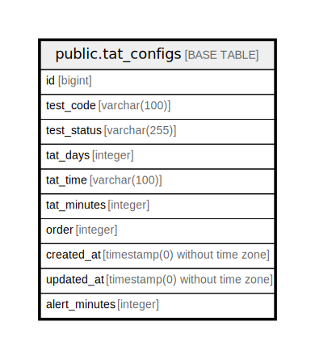

# public.tat_configs

## Description

## Columns

| Name | Type | Default | Nullable | Children | Parents | Comment |
| ---- | ---- | ------- | -------- | -------- | ------- | ------- |
| id | bigint | nextval('tat_configs_id_seq'::regclass) | false |  |  |  |
| test_code | varchar(100) |  | false |  |  |  |
| test_status | varchar(255) |  | false |  |  |  |
| tat_days | integer |  | true |  |  |  |
| tat_time | varchar(100) |  | true |  |  |  |
| tat_minutes | integer |  | true |  |  |  |
| order | integer | 0 | false |  |  |  |
| created_at | timestamp(0) without time zone |  | true |  |  |  |
| updated_at | timestamp(0) without time zone |  | true |  |  |  |
| alert_minutes | integer | 0 | true |  |  |  |

## Constraints

| Name | Type | Definition |
| ---- | ---- | ---------- |
| tat_configs_pkey | PRIMARY KEY | PRIMARY KEY (id) |

## Indexes

| Name | Definition |
| ---- | ---------- |
| tat_configs_pkey | CREATE UNIQUE INDEX tat_configs_pkey ON public.tat_configs USING btree (id) |
| tat_configs_test_code_index | CREATE INDEX tat_configs_test_code_index ON public.tat_configs USING btree (test_code) |

## Relations

---

> Generated by [tbls](https://github.com/k1LoW/tbls)
