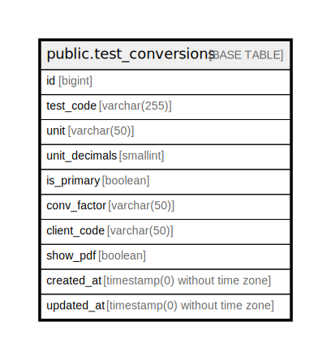

# public.test_conversions

## Description

## Columns

| Name | Type | Default | Nullable | Children | Parents | Comment |
| ---- | ---- | ------- | -------- | -------- | ------- | ------- |
| id | bigint | nextval('test_conversions_id_seq'::regclass) | false |  |  |  |
| test_code | varchar(255) |  | false |  |  |  |
| unit | varchar(50) |  | true |  |  |  |
| unit_decimals | smallint |  | true |  |  |  |
| is_primary | boolean | false | false |  |  |  |
| conv_factor | varchar(50) |  | false |  |  |  |
| client_code | varchar(50) |  | true |  |  |  |
| show_pdf | boolean | false | false |  |  |  |
| created_at | timestamp(0) without time zone |  | true |  |  |  |
| updated_at | timestamp(0) without time zone |  | true |  |  |  |

## Constraints

| Name | Type | Definition |
| ---- | ---- | ---------- |
| test_conversions_pkey | PRIMARY KEY | PRIMARY KEY (id) |

## Indexes

| Name | Definition |
| ---- | ---------- |
| test_conversions_pkey | CREATE UNIQUE INDEX test_conversions_pkey ON public.test_conversions USING btree (id) |
| test_conversions_test_code_index | CREATE INDEX test_conversions_test_code_index ON public.test_conversions USING btree (test_code) |

## Relations

---

> Generated by [tbls](https://github.com/k1LoW/tbls)
