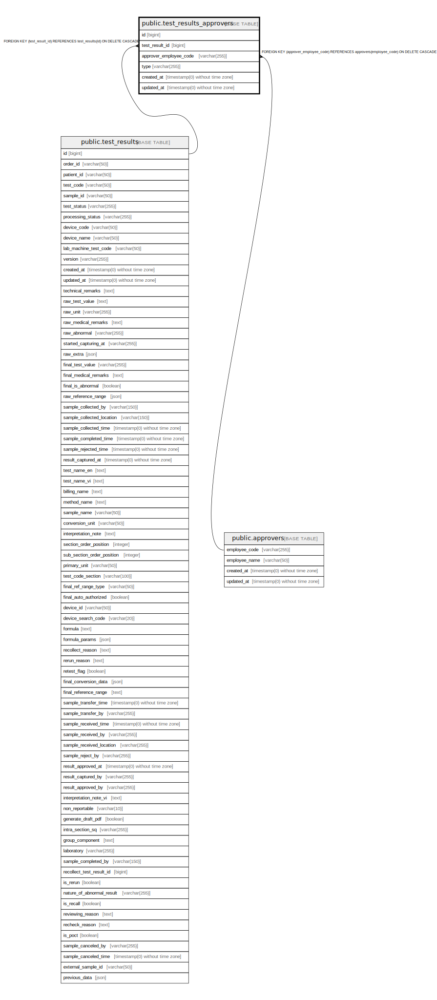

# public.test_results_approvers

## Description

## Columns

| Name | Type | Default | Nullable | Children | Parents | Comment |
| ---- | ---- | ------- | -------- | -------- | ------- | ------- |
| id | bigint | nextval('test_results_approvers_id_seq'::regclass) | false |  |  |  |
| test_result_id | bigint |  | false |  | [public.test_results](public.test_results.md) |  |
| approver_employee_code | varchar(255) |  | false |  | [public.approvers](public.approvers.md) |  |
| type | varchar(255) |  | false |  |  | Approver type: doctor, techlab, etc. |
| created_at | timestamp(0) without time zone |  | true |  |  |  |
| updated_at | timestamp(0) without time zone |  | true |  |  |  |

## Constraints

| Name | Type | Definition |
| ---- | ---- | ---------- |
| test_results_approvers_approver_employee_code_foreign | FOREIGN KEY | FOREIGN KEY (approver_employee_code) REFERENCES approvers(employee_code) ON DELETE CASCADE |
| test_results_approvers_test_result_id_foreign | FOREIGN KEY | FOREIGN KEY (test_result_id) REFERENCES test_results(id) ON DELETE CASCADE |
| test_results_approvers_pkey | PRIMARY KEY | PRIMARY KEY (id) |

## Indexes

| Name | Definition |
| ---- | ---------- |
| test_results_approvers_pkey | CREATE UNIQUE INDEX test_results_approvers_pkey ON public.test_results_approvers USING btree (id) |

## Relations

---

> Generated by [tbls](https://github.com/k1LoW/tbls)
