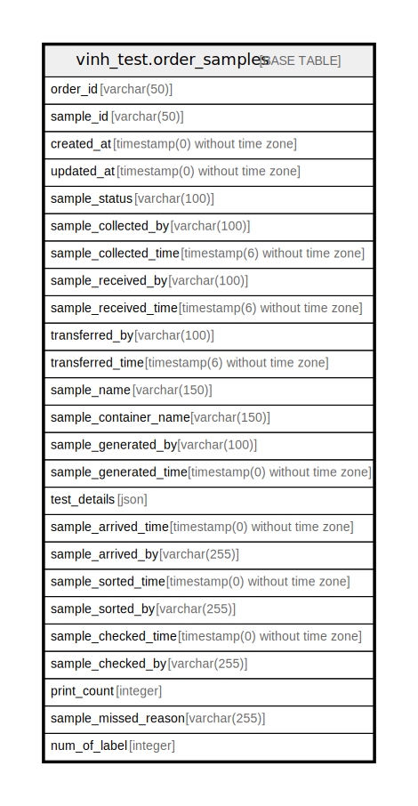

# vinh_test.order_samples

## Description

## Columns

| Name | Type | Default | Nullable | Children | Parents | Comment |
| ---- | ---- | ------- | -------- | -------- | ------- | ------- |
| order_id | varchar(50) |  | false |  |  | Attune VID |
| sample_id | varchar(50) |  | false |  |  | Attune Sample ID |
| created_at | timestamp(0) without time zone |  | true |  |  |  |
| updated_at | timestamp(0) without time zone |  | true |  |  |  |
| sample_status | varchar(100) |  | true |  |  |  |
| sample_collected_by | varchar(100) |  | true |  |  |  |
| sample_collected_time | timestamp(6) without time zone |  | true |  |  |  |
| sample_received_by | varchar(100) |  | true |  |  |  |
| sample_received_time | timestamp(6) without time zone |  | true |  |  |  |
| transferred_by | varchar(100) |  | true |  |  |  |
| transferred_time | timestamp(6) without time zone |  | true |  |  |  |
| sample_name | varchar(150) |  | true |  |  |  |
| sample_container_name | varchar(150) |  | true |  |  |  |
| sample_generated_by | varchar(100) |  | true |  |  |  |
| sample_generated_time | timestamp(0) without time zone |  | true |  |  |  |
| test_details | json |  | true |  |  |  |
| sample_arrived_time | timestamp(0) without time zone |  | true |  |  |  |
| sample_arrived_by | varchar(255) |  | true |  |  |  |
| sample_sorted_time | timestamp(0) without time zone |  | true |  |  |  |
| sample_sorted_by | varchar(255) |  | true |  |  |  |
| sample_checked_time | timestamp(0) without time zone |  | true |  |  |  |
| sample_checked_by | varchar(255) |  | true |  |  |  |
| print_count | integer | 0 | false |  |  |  |
| sample_missed_reason | varchar(255) |  | true |  |  |  |
| num_of_label | integer | 1 | false |  |  |  |

## Constraints

| Name | Type | Definition |
| ---- | ---- | ---------- |
| order_samples_pkey | PRIMARY KEY | PRIMARY KEY (order_id, sample_id) |

## Indexes

| Name | Definition |
| ---- | ---------- |
| order_samples_pkey | CREATE UNIQUE INDEX order_samples_pkey ON vinh_test.order_samples USING btree (order_id, sample_id) |

## Relations

---

> Generated by [tbls](https://github.com/k1LoW/tbls)
