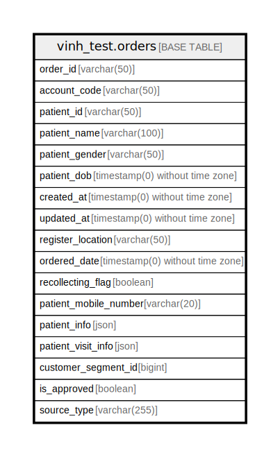

# vinh_test.orders

## Description

## Columns

| Name | Type | Default | Nullable | Children | Parents | Comment |
| ---- | ---- | ------- | -------- | -------- | ------- | ------- |
| order_id | varchar(50) |  | false |  |  |  |
| account_code | varchar(50) |  | false |  |  |  |
| patient_id | varchar(50) |  | false |  |  |  |
| patient_name | varchar(100) |  | false |  |  |  |
| patient_gender | varchar(50) |  | false |  |  |  |
| patient_dob | timestamp(0) without time zone |  | false |  |  |  |
| created_at | timestamp(0) without time zone |  | true |  |  |  |
| updated_at | timestamp(0) without time zone |  | true |  |  |  |
| register_location | varchar(50) |  | true |  |  |  |
| ordered_date | timestamp(0) without time zone |  | true |  |  |  |
| recollecting_flag | boolean | false | false |  |  |  |
| patient_mobile_number | varchar(20) |  | true |  |  |  |
| patient_info | json |  | true |  |  |  |
| patient_visit_info | json |  | true |  |  |  |
| customer_segment_id | bigint |  | true |  |  |  |
| is_approved | boolean | false | false |  |  |  |
| source_type | varchar(255) |  | true |  |  |  |

## Constraints

| Name | Type | Definition |
| ---- | ---- | ---------- |
| orders_pkey | PRIMARY KEY | PRIMARY KEY (order_id) |

## Indexes

| Name | Definition |
| ---- | ---------- |
| orders_pkey | CREATE UNIQUE INDEX orders_pkey ON vinh_test.orders USING btree (order_id) |

## Relations

---

> Generated by [tbls](https://github.com/k1LoW/tbls)
