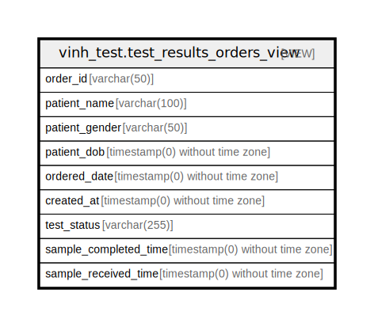

# vinh_test.test_results_orders_view

## Description

<details>
<summary><strong>Table Definition</strong></summary>

```sql
CREATE VIEW test_results_orders_view AS (
 SELECT o.order_id,
    o.patient_name,
    o.patient_gender,
    o.patient_dob,
    o.ordered_date,
    tr.created_at,
    tr.test_status,
    tr.sample_completed_time,
    tr.sample_received_time
   FROM (orders o
     JOIN vinh_test.test_results tr ON (((tr.order_id)::text = (o.order_id)::text)))
)
```

</details>

## Columns

| Name | Type | Default | Nullable | Children | Parents | Comment |
| ---- | ---- | ------- | -------- | -------- | ------- | ------- |
| order_id | varchar(50) |  | true |  |  |  |
| patient_name | varchar(100) |  | true |  |  |  |
| patient_gender | varchar(50) |  | true |  |  |  |
| patient_dob | timestamp(0) without time zone |  | true |  |  |  |
| ordered_date | timestamp(0) without time zone |  | true |  |  |  |
| created_at | timestamp(0) without time zone |  | true |  |  |  |
| test_status | varchar(255) |  | true |  |  |  |
| sample_completed_time | timestamp(0) without time zone |  | true |  |  |  |
| sample_received_time | timestamp(0) without time zone |  | true |  |  |  |

## Referenced Tables

| Name | Columns | Comment | Type |
| ---- | ------- | ------- | ---- |
| [public.orders](public.orders.md) | 24 |  | BASE TABLE |
| [vinh_test.test_results](vinh_test.test_results.md) | 68 |  | BASE TABLE |

## Relations



---

> Generated by [tbls](https://github.com/k1LoW/tbls)
