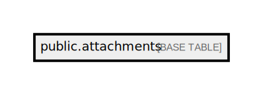

# public.attachments

## Description

## Columns

| Name                  | Type                           | Default                                 | Nullable | Comment        |
| --------------------- | ------------------------------ | --------------------------------------- | -------- | -------------- |
| id                    | bigint                         | nextval('attachments_id_seq'::regclass) | false    |                |
| order_id              | varchar(50)                    |                                         | true     |                |
| sample_id             | varchar(50)                    |                                         | true     |                |
| test_result_id        | bigint                         |                                         | true     | Test Result ID |
| type                  | varchar(10)                    |                                         | true     |                |
| file_path             | varchar(255)                   |                                         | true     |                |
| created_at            | timestamp(0) without time zone |                                         | true     |                |
| updated_at            | timestamp(0) without time zone |                                         | true     |                |
| lab_machine_test_code | varchar(255)                   |                                         | true     |                |
| test_code             | varchar(255)                   |                                         | true     |                |
| is_merged             | boolean                        |                                         | true     |                |
| deleted_at            | timestamp(0) without time zone |                                         | true     |                |
| reportable            | boolean                        | true                                    | false    |                |

## Constraints

| Name             | Type        | Definition       |
| ---------------- | ----------- | ---------------- |
| attachments_pkey | PRIMARY KEY | PRIMARY KEY (id) |

## Indexes

| Name                       | Definition                                                                           |
| -------------------------- | ------------------------------------------------------------------------------------ |
| attachments_pkey           | CREATE UNIQUE INDEX attachments_pkey ON public.attachments USING btree (id)          |
| attachments_order_id_index | CREATE INDEX attachments_order_id_index ON public.attachments USING btree (order_id) |

## Relations

---

> Generated by [tbls](https://github.com/k1LoW/tbls)
