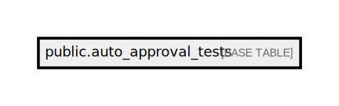

# public.auto_approval_tests

## Description

## Columns

| Name         | Type         | Default                                         | Nullable |
| ------------ | ------------ | ----------------------------------------------- | -------- |
| id           | bigint       | nextval('auto_approval_tests_id_seq'::regclass) | false    |
| doctor_email | varchar(255) |                                                 | false    |
| status       | boolean      | true                                            | false    |
| value        | varchar(255) |                                                 | false    |
| value_type   | varchar(255) |                                                 | false    |

## Constraints

| Name                     | Type        | Definition       |
| ------------------------ | ----------- | ---------------- |
| auto_approval_tests_pkey | PRIMARY KEY | PRIMARY KEY (id) |

## Indexes

| Name                     | Definition                                                                                  |
| ------------------------ | ------------------------------------------------------------------------------------------- |
| auto_approval_tests_pkey | CREATE UNIQUE INDEX auto_approval_tests_pkey ON public.auto_approval_tests USING btree (id) |

## Relations

---

> Generated by [tbls](https://github.com/k1LoW/tbls)
