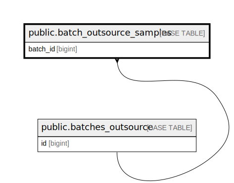

# public.batch_outsource_samples

## Description

## Columns

| Name       | Type                           | Default                                             | Nullable | Parents                                                 |
| ---------- | ------------------------------ | --------------------------------------------------- | -------- | ------------------------------------------------------- |
| id         | bigint                         | nextval('batch_outsource_samples_id_seq'::regclass) | false    |                                                         |
| batch_id   | bigint                         |                                                     | false    | [public.batches_outsource](public.batches_outsource.md) |
| sample_id  | varchar(255)                   |                                                     | false    |                                                         |
| created_at | timestamp(0) without time zone |                                                     | true     |                                                         |
| updated_at | timestamp(0) without time zone |                                                     | true     |                                                         |

## Constraints

| Name                                     | Type        | Definition                                              |
| ---------------------------------------- | ----------- | ------------------------------------------------------- |
| batch_outsource_samples_batch_id_foreign | FOREIGN KEY | FOREIGN KEY (batch_id) REFERENCES batches_outsource(id) |
| batch_outsource_samples_pkey             | PRIMARY KEY | PRIMARY KEY (id)                                        |
| batch_outsource_samples_sample_id_unique | UNIQUE      | UNIQUE (sample_id)                                      |

## Indexes

| Name                                     | Definition                                                                                                             |
| ---------------------------------------- | ---------------------------------------------------------------------------------------------------------------------- |
| batch_outsource_samples_pkey             | CREATE UNIQUE INDEX batch_outsource_samples_pkey ON public.batch_outsource_samples USING btree (id)                    |
| batch_outsource_samples_sample_id_unique | CREATE UNIQUE INDEX batch_outsource_samples_sample_id_unique ON public.batch_outsource_samples USING btree (sample_id) |

## Relations

---

> Generated by [tbls](https://github.com/k1LoW/tbls)
