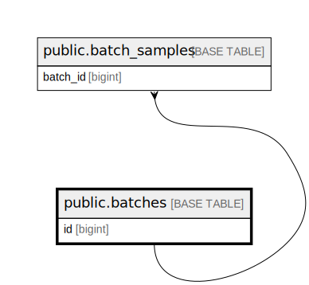

# public.batches

## Description

## Columns

| Name                 | Type                           | Default                             | Nullable | Children                                        |
| -------------------- | ------------------------------ | ----------------------------------- | -------- | ----------------------------------------------- |
| id                   | bigint                         | nextval('batches_id_seq'::regclass) | false    | [public.batch_samples](public.batch_samples.md) |
| batch_name           | varchar(255)                   |                                     | false    |                                                 |
| batch_description    | text                           |                                     | true     |                                                 |
| batch_code           | varchar(255)                   |                                     | false    |                                                 |
| source_location      | varchar(255)                   |                                     | false    |                                                 |
| destination_location | varchar(255)                   |                                     | false    |                                                 |
| status               | varchar(255)                   |                                     | false    |                                                 |
| created_by           | varchar(255)                   |                                     | false    |                                                 |
| transferred_at       | timestamp(0) without time zone |                                     | true     |                                                 |
| cancelled_at         | timestamp(0) without time zone |                                     | true     |                                                 |
| completed_at         | timestamp(0) without time zone |                                     | true     |                                                 |
| created_at           | timestamp(0) without time zone |                                     | true     |                                                 |
| updated_at           | timestamp(0) without time zone |                                     | true     |                                                 |
| total_sample         | integer                        | 0                                   | false    |                                                 |
| arrived_reason       | varchar(255)                   |                                     | true     |                                                 |

## Constraints

| Name                      | Type        | Definition          |
| ------------------------- | ----------- | ------------------- |
| batches_pkey              | PRIMARY KEY | PRIMARY KEY (id)    |
| batches_batch_code_unique | UNIQUE      | UNIQUE (batch_code) |

## Indexes

| Name                      | Definition                                                                               |
| ------------------------- | ---------------------------------------------------------------------------------------- |
| batches_pkey              | CREATE UNIQUE INDEX batches_pkey ON public.batches USING btree (id)                      |
| batches_batch_code_unique | CREATE UNIQUE INDEX batches_batch_code_unique ON public.batches USING btree (batch_code) |

## Relations

---

> Generated by [tbls](https://github.com/k1LoW/tbls)
