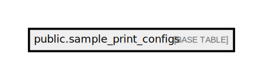

# public.sample_print_configs

## Description

## Columns

| Name         | Type                           | Default                                          | Nullable |
| ------------ | ------------------------------ | ------------------------------------------------ | -------- |
| id           | bigint                         | nextval('sample_print_configs_id_seq'::regclass) | false    |
| sample_name  | varchar(255)                   |                                                  | false    |
| num_of_label | integer                        |                                                  | false    |
| created_at   | timestamp(0) without time zone |                                                  | true     |
| updated_at   | timestamp(0) without time zone |                                                  | true     |

## Constraints

| Name                                    | Type        | Definition           |
| --------------------------------------- | ----------- | -------------------- |
| sample_print_configs_pkey               | PRIMARY KEY | PRIMARY KEY (id)     |
| sample_print_configs_sample_name_unique | UNIQUE      | UNIQUE (sample_name) |

## Indexes

| Name                                    | Definition                                                                                                           |
| --------------------------------------- | -------------------------------------------------------------------------------------------------------------------- |
| sample_print_configs_pkey               | CREATE UNIQUE INDEX sample_print_configs_pkey ON public.sample_print_configs USING btree (id)                        |
| sample_print_configs_sample_name_unique | CREATE UNIQUE INDEX sample_print_configs_sample_name_unique ON public.sample_print_configs USING btree (sample_name) |

## Relations

---

> Generated by [tbls](https://github.com/k1LoW/tbls)
