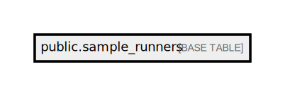

# public.sample_runners

## Description

## Columns

| Name          | Type                           | Default                                    | Nullable |
| ------------- | ------------------------------ | ------------------------------------------ | -------- |
| id            | bigint                         | nextval('sample_runners_id_seq'::regclass) | false    |
| sample_prefix | varchar(255)                   |                                            | false    |
| run_number    | integer                        |                                            | false    |
| created_at    | timestamp(0) without time zone |                                            | true     |
| updated_at    | timestamp(0) without time zone |                                            | true     |

## Constraints

| Name                                | Type        | Definition             |
| ----------------------------------- | ----------- | ---------------------- |
| sample_runners_pkey                 | PRIMARY KEY | PRIMARY KEY (id)       |
| sample_runners_sample_prefix_unique | UNIQUE      | UNIQUE (sample_prefix) |

## Indexes

| Name                                | Definition                                                                                                   |
| ----------------------------------- | ------------------------------------------------------------------------------------------------------------ |
| sample_runners_pkey                 | CREATE UNIQUE INDEX sample_runners_pkey ON public.sample_runners USING btree (id)                            |
| sample_runners_sample_prefix_unique | CREATE UNIQUE INDEX sample_runners_sample_prefix_unique ON public.sample_runners USING btree (sample_prefix) |

## Relations

---

> Generated by [tbls](https://github.com/k1LoW/tbls)
