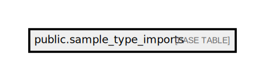

# public.sample_type_imports

## Description

## Columns

| Name                  | Type                           | Default                                         | Nullable |
| --------------------- | ------------------------------ | ----------------------------------------------- | -------- |
| id                    | bigint                         | nextval('sample_type_imports_id_seq'::regclass) | false    |
| sample_name           | varchar(255)                   |                                                 | false    |
| sample_container_name | varchar(255)                   |                                                 | false    |
| display_code          | varchar(255)                   |                                                 | false    |
| test_code             | varchar(255)                   |                                                 | false    |
| created_at            | timestamp(0) without time zone |                                                 | true     |
| updated_at            | timestamp(0) without time zone |                                                 | true     |

## Constraints

| Name                                 | Type        | Definition         |
| ------------------------------------ | ----------- | ------------------ |
| sample_type_imports_pkey             | PRIMARY KEY | PRIMARY KEY (id)   |
| sample_type_imports_test_code_unique | UNIQUE      | UNIQUE (test_code) |

## Indexes

| Name                                 | Definition                                                                                                     |
| ------------------------------------ | -------------------------------------------------------------------------------------------------------------- |
| sample_type_imports_pkey             | CREATE UNIQUE INDEX sample_type_imports_pkey ON public.sample_type_imports USING btree (id)                    |
| sample_type_imports_test_code_unique | CREATE UNIQUE INDEX sample_type_imports_test_code_unique ON public.sample_type_imports USING btree (test_code) |

## Relations

---

> Generated by [tbls](https://github.com/k1LoW/tbls)
