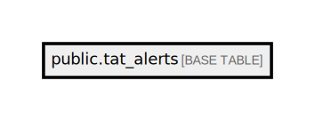

# public.tat_alerts

## Description

## Columns

| Name                      | Type                           | Default                                | Nullable |
| ------------------------- | ------------------------------ | -------------------------------------- | -------- |
| id                        | bigint                         | nextval('tat_alerts_id_seq'::regclass) | false    |
| order_id                  | varchar(50)                    |                                        | false    |
| test_code                 | varchar(100)                   |                                        | true     |
| to_status                 | varchar(255)                   |                                        | false    |
| expected_time             | timestamp(0) without time zone |                                        | false    |
| created_at                | timestamp(0) without time zone |                                        | true     |
| updated_at                | timestamp(0) without time zone |                                        | true     |
| sample_id                 | varchar(100)                   |                                        | true     |
| type                      | varchar(10)                    |                                        | true     |
| disabled                  | boolean                        | false                                  | false    |
| current_status            | varchar(255)                   |                                        | true     |
| test_name_en              | text                           |                                        | true     |
| test_name_vi              | text                           |                                        | true     |
| patient_id                | varchar(50)                    |                                        | true     |
| patient_name              | varchar(255)                   |                                        | true     |
| test_code_section         | varchar(100)                   |                                        | true     |
| account_code              | varchar(50)                    |                                        | true     |
| register_location         | varchar(50)                    |                                        | true     |
| sample_collected_location | varchar(100)                   |                                        | true     |
| customer_segment_id       | bigint                         |                                        | true     |
| is_outdated               | boolean                        | false                                  | false    |
| exec_time                 | timestamp(0) without time zone |                                        | true     |

## Constraints

| Name            | Type        | Definition       |
| --------------- | ----------- | ---------------- |
| tat_alerts_pkey | PRIMARY KEY | PRIMARY KEY (id) |

## Indexes

| Name                                                            | Definition                                                                                                                                                                                 |
| --------------------------------------------------------------- | ------------------------------------------------------------------------------------------------------------------------------------------------------------------------------------------ |
| tat_alerts_pkey                                                 | CREATE UNIQUE INDEX tat_alerts_pkey ON public.tat_alerts USING btree (id)                                                                                                                  |
| tat_alerts_order_id_sample_id_to_status_expected_time_disabled_ | CREATE INDEX tat_alerts_order_id_sample_id_to_status_expected_time_disabled_ ON public.tat_alerts USING btree (order_id, sample_id, to_status, expected_time, disabled)                    |
| tat_alerts_order_id_test_code_section_to_status_test_code_expec | CREATE INDEX tat_alerts_order_id_test_code_section_to_status_test_code_expec ON public.tat_alerts USING btree (order_id, test_code_section, to_status, test_code, expected_time, disabled) |
| tat_alerts_account_code_to_status_index                         | CREATE INDEX tat_alerts_account_code_to_status_index ON public.tat_alerts USING btree (account_code, to_status)                                                                            |
| tat_alerts_register_location_to_status_index                    | CREATE INDEX tat_alerts_register_location_to_status_index ON public.tat_alerts USING btree (register_location, to_status)                                                                  |
| tat_alerts_sample_collected_location_to_status_index            | CREATE INDEX tat_alerts_sample_collected_location_to_status_index ON public.tat_alerts USING btree (sample_collected_location, to_status)                                                  |
| tat_alerts_test_code_section_to_status_index                    | CREATE INDEX tat_alerts_test_code_section_to_status_index ON public.tat_alerts USING btree (test_code_section, to_status)                                                                  |
| tat_alerts_customer_segment_id_to_status_index                  | CREATE INDEX tat_alerts_customer_segment_id_to_status_index ON public.tat_alerts USING btree (customer_segment_id, to_status)                                                              |

## Relations

---

> Generated by [tbls](https://github.com/k1LoW/tbls)
