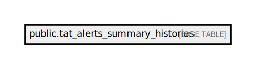

# public.tat_alerts_summary_histories

## Description

## Columns

| Name       | Type                           | Default                                                  | Nullable |
| ---------- | ------------------------------ | -------------------------------------------------------- | -------- |
| id         | bigint                         | nextval('tat_alerts_summary_histories_id_seq'::regclass) | false    |
| exec_time  | timestamp(0) without time zone |                                                          | false    |
| to_status  | varchar(255)                   |                                                          | false    |
| remaining  | integer                        |                                                          | false    |
| outdated   | integer                        |                                                          | false    |
| created_at | timestamp(0) without time zone |                                                          | true     |
| updated_at | timestamp(0) without time zone |                                                          | true     |

## Constraints

| Name                              | Type        | Definition       |
| --------------------------------- | ----------- | ---------------- |
| tat_alerts_summary_histories_pkey | PRIMARY KEY | PRIMARY KEY (id) |

## Indexes

| Name                                         | Definition                                                                                                               |
| -------------------------------------------- | ------------------------------------------------------------------------------------------------------------------------ |
| tat_alerts_summary_histories_pkey            | CREATE UNIQUE INDEX tat_alerts_summary_histories_pkey ON public.tat_alerts_summary_histories USING btree (id)            |
| tat_alerts_summary_histories_exec_time_index | CREATE INDEX tat_alerts_summary_histories_exec_time_index ON public.tat_alerts_summary_histories USING btree (exec_time) |

## Relations

---

> Generated by [tbls](https://github.com/k1LoW/tbls)
