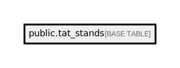

# public.tat_stands

## Description

## Columns

| Name                     | Type                           | Default                                | Nullable |
| ------------------------ | ------------------------------ | -------------------------------------- | -------- |
| id                       | bigint                         | nextval('tat_stands_id_seq'::regclass) | false    |
| test_code                | varchar(100)                   |                                        | false    |
| tat_freq_type            | varchar(50)                    |                                        | true     |
| cut_off_day              | varchar(255)                   |                                        | false    |
| cut_off_time             | varchar(100)                   |                                        | true     |
| sunday_run               | boolean                        | false                                  | false    |
| cut_off_time_sunday      | varchar(100)                   |                                        | true     |
| result_time_after_cutoff | varchar(100)                   |                                        | true     |
| created_at               | timestamp(0) without time zone |                                        | true     |
| updated_at               | timestamp(0) without time zone |                                        | true     |

## Constraints

| Name            | Type        | Definition       |
| --------------- | ----------- | ---------------- |
| tat_stands_pkey | PRIMARY KEY | PRIMARY KEY (id) |

## Indexes

| Name                       | Definition                                                                           |
| -------------------------- | ------------------------------------------------------------------------------------ |
| tat_stands_pkey            | CREATE UNIQUE INDEX tat_stands_pkey ON public.tat_stands USING btree (id)            |
| tat_stands_test_code_index | CREATE INDEX tat_stands_test_code_index ON public.tat_stands USING btree (test_code) |

## Relations

---

> Generated by [tbls](https://github.com/k1LoW/tbls)
