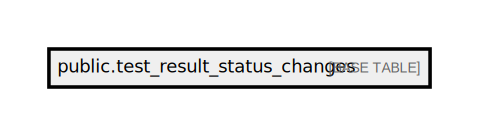

# public.test_result_status_changes

## Description

## Columns

| Name               | Type                           | Default                                                | Nullable |
| ------------------ | ------------------------------ | ------------------------------------------------------ | -------- |
| id                 | bigint                         | nextval('test_result_status_changes_id_seq'::regclass) | false    |
| order_id           | varchar(50)                    |                                                        | false    |
| test_result_id     | bigint                         |                                                        | false    |
| new_test_result_id | bigint                         |                                                        | true     |
| from_status        | varchar(255)                   |                                                        | false    |
| to_status          | varchar(255)                   |                                                        | false    |
| reason             | text                           |                                                        | true     |
| status_changed_by  | varchar(255)                   |                                                        | false    |
| status_changed_at  | timestamp(0) without time zone |                                                        | false    |
| created_at         | timestamp(0) without time zone |                                                        | true     |
| updated_at         | timestamp(0) without time zone |                                                        | true     |
| value              | text                           |                                                        | true     |
| previous           | json                           |                                                        | true     |

## Constraints

| Name                            | Type        | Definition       |
| ------------------------------- | ----------- | ---------------- |
| test_result_status_changes_pkey | PRIMARY KEY | PRIMARY KEY (id) |

## Indexes

| Name                            | Definition                                                                                                |
| ------------------------------- | --------------------------------------------------------------------------------------------------------- |
| test_result_status_changes_pkey | CREATE UNIQUE INDEX test_result_status_changes_pkey ON public.test_result_status_changes USING btree (id) |

## Relations

---

> Generated by [tbls](https://github.com/k1LoW/tbls)
