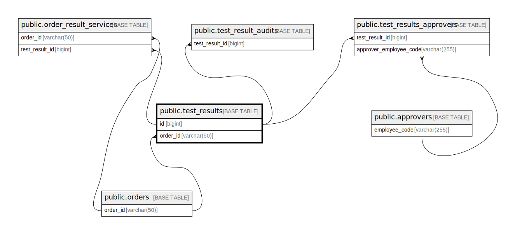

# public.test_results

## Description

## Columns

| Name                       | Type                           | Default                                  | Nullable | Children                                                                                                                                                                                    | Parents                           | Comment                                              |
| -------------------------- | ------------------------------ | ---------------------------------------- | -------- | ------------------------------------------------------------------------------------------------------------------------------------------------------------------------------------------- | --------------------------------- | ---------------------------------------------------- |
| id                         | bigint                         | nextval('test_results_id_seq'::regclass) | false    | [public.test_result_audits](public.test_result_audits.md) [public.test_results_approvers](public.test_results_approvers.md) [public.order_result_services](public.order_result_services.md) |                                   |                                                      |
| order_id                   | varchar(50)                    |                                          | true     |                                                                                                                                                                                             | [public.orders](public.orders.md) |                                                      |
| patient_id                 | varchar(50)                    |                                          | true     |                                                                                                                                                                                             |                                   |                                                      |
| test_code                  | varchar(50)                    |                                          | true     |                                                                                                                                                                                             |                                   |                                                      |
| sample_id                  | varchar(50)                    |                                          | false    |                                                                                                                                                                                             |                                   |                                                      |
| test_status                | varchar(255)                   |                                          | false    |                                                                                                                                                                                             |                                   |                                                      |
| processing_status          | varchar(255)                   |                                          | true     |                                                                                                                                                                                             |                                   |                                                      |
| device_code                | varchar(50)                    |                                          | true     |                                                                                                                                                                                             |                                   |                                                      |
| device_name                | varchar(50)                    |                                          | true     |                                                                                                                                                                                             |                                   |                                                      |
| lab_machine_test_code      | varchar(50)                    |                                          | true     |                                                                                                                                                                                             |                                   |                                                      |
| version                    | varchar(255)                   |                                          | true     |                                                                                                                                                                                             |                                   |                                                      |
| created_at                 | timestamp(0) without time zone |                                          | true     |                                                                                                                                                                                             |                                   |                                                      |
| updated_at                 | timestamp(0) without time zone |                                          | true     |                                                                                                                                                                                             |                                   |                                                      |
| technical_remarks          | text                           |                                          | true     |                                                                                                                                                                                             |                                   |                                                      |
| raw_test_value             | text                           |                                          | true     |                                                                                                                                                                                             |                                   |                                                      |
| raw_unit                   | varchar(255)                   |                                          | true     |                                                                                                                                                                                             |                                   |                                                      |
| raw_medical_remarks        | text                           |                                          | true     |                                                                                                                                                                                             |                                   |                                                      |
| raw_abnormal               | varchar(255)                   |                                          | true     |                                                                                                                                                                                             |                                   |                                                      |
| started_capturing_at       | varchar(255)                   |                                          | true     |                                                                                                                                                                                             |                                   |                                                      |
| raw_extra                  | json                           |                                          | true     |                                                                                                                                                                                             |                                   |                                                      |
| final_test_value           | varchar(255)                   |                                          | true     |                                                                                                                                                                                             |                                   |                                                      |
| final_medical_remarks      | text                           |                                          | true     |                                                                                                                                                                                             |                                   |                                                      |
| final_is_abnormal          | boolean                        |                                          | true     |                                                                                                                                                                                             |                                   |                                                      |
| raw_reference_range        | json                           |                                          | true     |                                                                                                                                                                                             |                                   |                                                      |
| sample_collected_by        | varchar(150)                   |                                          | true     |                                                                                                                                                                                             |                                   |                                                      |
| sample_collected_location  | varchar(150)                   |                                          | true     |                                                                                                                                                                                             |                                   |                                                      |
| sample_collected_time      | timestamp(0) without time zone |                                          | true     |                                                                                                                                                                                             |                                   |                                                      |
| sample_completed_time      | timestamp(0) without time zone |                                          | true     |                                                                                                                                                                                             |                                   |                                                      |
| sample_rejected_time       | timestamp(0) without time zone |                                          | true     |                                                                                                                                                                                             |                                   |                                                      |
| result_captured_at         | timestamp(0) without time zone |                                          | true     |                                                                                                                                                                                             |                                   |                                                      |
| test_name_en               | text                           |                                          | true     |                                                                                                                                                                                             |                                   |                                                      |
| test_name_vi               | text                           |                                          | true     |                                                                                                                                                                                             |                                   |                                                      |
| billing_name               | text                           |                                          | true     |                                                                                                                                                                                             |                                   |                                                      |
| method_name                | text                           |                                          | true     |                                                                                                                                                                                             |                                   |                                                      |
| sample_name                | varchar(50)                    |                                          | true     |                                                                                                                                                                                             |                                   |                                                      |
| conversion_unit            | varchar(50)                    |                                          | true     |                                                                                                                                                                                             |                                   |                                                      |
| interpretation_note        | text                           |                                          | true     |                                                                                                                                                                                             |                                   |                                                      |
| section_order_position     | integer                        |                                          | true     |                                                                                                                                                                                             |                                   |                                                      |
| sub_section_order_position | integer                        |                                          | true     |                                                                                                                                                                                             |                                   |                                                      |
| primary_unit               | varchar(50)                    |                                          | true     |                                                                                                                                                                                             |                                   | Primary Unit for Test Result base on LIS Master Data |
| test_code_section          | varchar(100)                   |                                          | true     |                                                                                                                                                                                             |                                   | Section for Test Code base on LIS Master Data        |
| final_ref_range_type       | varchar(50)                    |                                          | true     |                                                                                                                                                                                             |                                   |                                                      |
| final_auto_authorized      | boolean                        | false                                    | false    |                                                                                                                                                                                             |                                   | The test is in auto approve range or not             |
| device_id                  | varchar(50)                    |                                          | true     |                                                                                                                                                                                             |                                   | Lab machine indentifier                              |
| device_search_code         | varchar(20)                    |                                          | true     |                                                                                                                                                                                             |                                   | Device code for search                               |
| formula                    | text                           |                                          | true     |                                                                                                                                                                                             |                                   | Test calculation formula                             |
| formula_params             | json                           |                                          | true     |                                                                                                                                                                                             |                                   |                                                      |
| recollect_reason           | text                           |                                          | true     |                                                                                                                                                                                             |                                   |                                                      |
| rerun_reason               | text                           |                                          | true     |                                                                                                                                                                                             |                                   |                                                      |
| retest_flag                | boolean                        | false                                    | false    |                                                                                                                                                                                             |                                   |                                                      |
| final_conversion_data      | json                           |                                          | true     |                                                                                                                                                                                             |                                   |                                                      |
| final_reference_range      | text                           |                                          | true     |                                                                                                                                                                                             |                                   |                                                      |
| sample_transfer_time       | timestamp(0) without time zone |                                          | true     |                                                                                                                                                                                             |                                   |                                                      |
| sample_transfer_by         | varchar(255)                   |                                          | true     |                                                                                                                                                                                             |                                   |                                                      |
| sample_received_time       | timestamp(0) without time zone |                                          | true     |                                                                                                                                                                                             |                                   |                                                      |
| sample_received_by         | varchar(255)                   |                                          | true     |                                                                                                                                                                                             |                                   |                                                      |
| sample_received_location   | varchar(255)                   |                                          | true     |                                                                                                                                                                                             |                                   |                                                      |
| sample_reject_by           | varchar(255)                   |                                          | true     |                                                                                                                                                                                             |                                   |                                                      |
| result_approved_at         | timestamp(0) without time zone |                                          | true     |                                                                                                                                                                                             |                                   |                                                      |
| result_captured_by         | varchar(255)                   |                                          | true     |                                                                                                                                                                                             |                                   |                                                      |
| result_approved_by         | varchar(255)                   |                                          | true     |                                                                                                                                                                                             |                                   |                                                      |
| interpretation_note_vi     | text                           |                                          | true     |                                                                                                                                                                                             |                                   |                                                      |
| non_reportable             | varchar(10)                    | 'Y'::character varying                   | false    |                                                                                                                                                                                             |                                   |                                                      |
| generate_draft_pdf         | boolean                        | true                                     | false    |                                                                                                                                                                                             |                                   |                                                      |
| intra_section_sq           | varchar(255)                   |                                          | true     |                                                                                                                                                                                             |                                   |                                                      |
| group_component            | text                           |                                          | true     |                                                                                                                                                                                             |                                   |                                                      |
| laboratory                 | varchar(255)                   |                                          | true     |                                                                                                                                                                                             |                                   |                                                      |
| sample_completed_by        | varchar(150)                   |                                          | true     |                                                                                                                                                                                             |                                   |                                                      |
| recollect_test_result_id   | bigint                         |                                          | true     |                                                                                                                                                                                             |                                   |                                                      |
| is_rerun                   | boolean                        | false                                    | false    |                                                                                                                                                                                             |                                   |                                                      |
| nature_of_abnormal_result  | varchar(255)                   |                                          | true     |                                                                                                                                                                                             |                                   |                                                      |
| is_recall                  | boolean                        |                                          | true     |                                                                                                                                                                                             |                                   |                                                      |
| reviewing_reason           | text                           |                                          | true     |                                                                                                                                                                                             |                                   |                                                      |
| recheck_reason             | text                           |                                          | true     |                                                                                                                                                                                             |                                   |                                                      |
| is_poct                    | boolean                        | false                                    | true     |                                                                                                                                                                                             |                                   |                                                      |
| sample_canceled_by         | varchar(255)                   |                                          | true     |                                                                                                                                                                                             |                                   |                                                      |
| sample_canceled_time       | timestamp(0) without time zone |                                          | true     |                                                                                                                                                                                             |                                   |                                                      |
| external_sample_id         | varchar(50)                    |                                          | true     |                                                                                                                                                                                             |                                   |                                                      |
| previous_data              | json                           |                                          | true     |                                                                                                                                                                                             |                                   |                                                      |

## Constraints

| Name                          | Type        | Definition                                                           |
| ----------------------------- | ----------- | -------------------------------------------------------------------- |
| test_results_order_id_foreign | FOREIGN KEY | FOREIGN KEY (order_id) REFERENCES orders(order_id) ON DELETE CASCADE |
| test_results_pkey             | PRIMARY KEY | PRIMARY KEY (id)                                                     |

## Indexes

| Name                                               | Definition                                                                                                                                                                                                 |
| -------------------------------------------------- | ---------------------------------------------------------------------------------------------------------------------------------------------------------------------------------------------------------- |
| test_results_pkey                                  | CREATE UNIQUE INDEX test_results_pkey ON public.test_results USING btree (id)                                                                                                                              |
| test_results_sample_completed_time_index           | CREATE INDEX test_results_sample_completed_time_index ON public.test_results USING btree (sample_completed_time)                                                                                           |
| test_results_sample_id_lab_machine_test_code_index | CREATE INDEX test_results_sample_id_lab_machine_test_code_index ON public.test_results USING btree (sample_id, lab_machine_test_code)                                                                      |
| test_results_test_approved_at_idx                  | CREATE INDEX test_results_test_approved_at_idx ON public.test_results USING btree (result_approved_at, sample_collected_by) WHERE ((sample_collected_by IS NOT NULL) AND (result_approved_at IS NOT NULL)) |
| result_approved_at_index                           | CREATE INDEX result_approved_at_index ON public.test_results USING btree (result_approved_at)                                                                                                              |
| data_archiving_test_results_idx                    | CREATE INDEX data_archiving_test_results_idx ON public.test_results USING btree (created_at)                                                                                                               |
| test_results_order_id_index                        | CREATE INDEX test_results_order_id_index ON public.test_results USING btree (order_id)                                                                                                                     |
| labtech_todo_test_results_idx                      | CREATE INDEX labtech_todo_test_results_idx ON public.test_results USING btree (sample_received_time, test_code_section, test_status) WHERE (sample_received_time IS NOT NULL)                              |
| pending_list_tr_update_at_idx                      | CREATE INDEX pending_list_tr_update_at_idx ON public.test_results USING btree (updated_at)                                                                                                                 |
| count_todo_tr_idx                                  | CREATE INDEX count_todo_tr_idx ON public.test_results USING btree (test_status, test_code_section, test_code, sample_received_time) INCLUDE (order_id, sample_id, sample_completed_time)                   |
| outsource_test_tr_idx                              | CREATE INDEX outsource_test_tr_idx ON public.test_results USING btree (test_status) INCLUDE (sample_id) WHERE ((order_id IS NOT NULL) AND ((laboratory)::text <> 'Diag'::text))                            |
| tr_analyzer_test_idx                               | CREATE INDEX tr_analyzer_test_idx ON public.test_results USING btree (device_search_code, test_code_section) WHERE (order_id IS NOT NULL)                                                                  |

## Relations

---

> Generated by [tbls](https://github.com/k1LoW/tbls)
